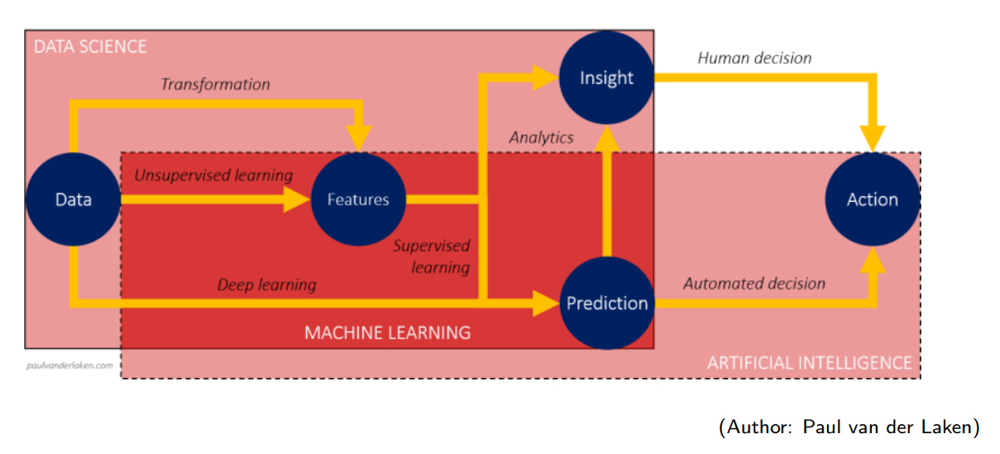
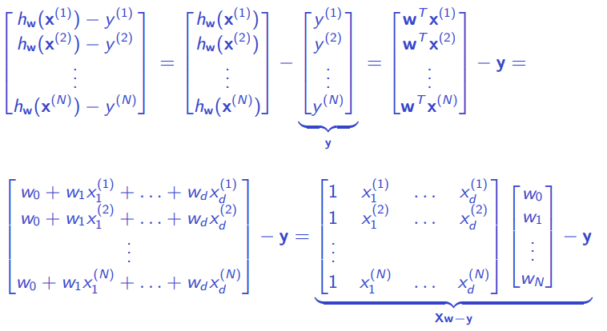
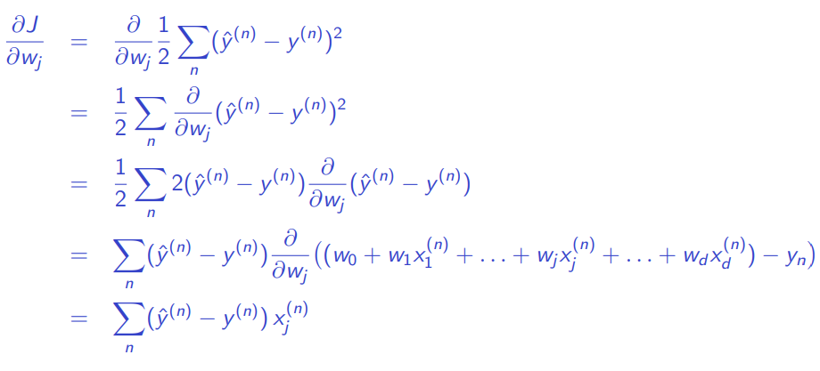
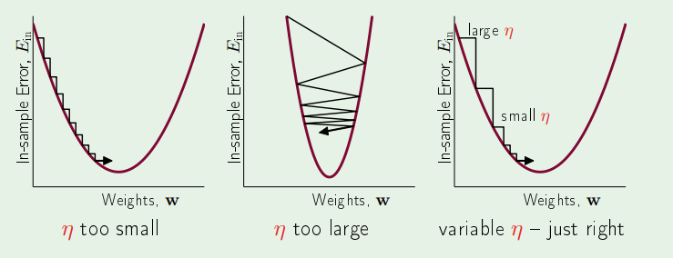

# MAC0460 - Introdução ao Aprendizado de Máquina

Oferecimento da disciplina no primeiro semestre de 2021, com a professora Nina S. T. Hirata, no Instituto de Matemática e Estatística da USP.

**Bibliografia**

- **Book:** Abu-Mostafa et al. *Learning from Data,* 2012
- [*Machine Learning* online course (MOOC)](https://work.caltech.edu/telecourse.html) — Caltech (video-lectures, slides)

**Avaliação**

- EPs
- Exercícios escritos
- QTs: Tarefas rápidas (~10% da nota final)

## Introdução

### O que é Machine Learning?

- Inteligência artificial
- Data Science
  - The fourth paradigm
  - Big data (5V: volume, velocity, variety, veracity, value)
  - Deep learning

Machine learning é parte de inteligência artificial e data science.

### Sob uma perspectiva computacional...

Computadores processam dados de acordo com algoritmos, e algoritmos são soluções para problemas computacionais. Em machine learning lidaremos com relações de *input-output* com dados complexos, casos ambíguos e dados que mudam frequentemente. Em geral **é difícil criar um algoritmo, mas fácil de listar pares *input-output***.

Em vez de escrever um código específico, podemos considerar um **modelo genérico para mapear entradas e saídas**, ajustando seus parâmetros a partir de dados de treinamento disponíveis.

Sob um ponto de vista puramente computacional, machine learning é uma abordagem de meta-programação.

## Problemas de machine learning

### Assumimos...

- Disponibilidade de exemplos de entrada-saída: $(x^{(n)}, y^{(n)}), n=1, \dots, N$
- A existência de uma relação plausível entre $x$ e $y$

### Problemas que gostaríamos de resolver:

Encontrar um mapeamento (programa de computador) que leva $x$ a $y$. Discutiremos **regressão** e **classificação**.

Técnicas de ML utilizadas para resolver problemas típicos de regressão e classificação costumam ser chamados **supervisionadas**. Supervisão se refere ao fato de que a saída $y$ esperada é conhecida para cada observação $x$ no conjunto exemplo de entrada.

A saída esperada $y$ é utilizada em algoritmos de ML para guiar o processo de aprendizado *(por isso se chama "supervisionado")*. 

### Problemas de regressão

$y$ é uma variável contínua $\implies$ o problema é de **regressão**

Encontrando $f$ tal que $y=f(x)$: podemos escolher $f(x; w, b) = wx + b$, com $w, b$ parâmetros do modelo *(para simplificar, vamos tentar uma função afim)*.

#### Formalizando...

Dado um conjunto de treinamento $\{(x^{(n)}, y^{(n)}): n = 1, \dots, N\}$ e a família $\mathcal{F} = \{f(x) = wx + b:w, x, b \in \mathbb{R} \}$, escolha $f^* \in \mathcal{F}$ (ou $w$ e $b$) tal que $f^*(x^{(n)})=y^{(n)},  n=1, ...,N$. Isso é possível? **NÃO!**

Então vamos encontrar lha $f^* \in \mathcal{F}$ (ou $w$ e $b$) tal que $f^*(x^{(n)}) \approx y^{(n)},  n=1, ...,N$.

Portanto, precisamos medir quão perto $f^*(x^{(n)})$ está de $y^{(n)}$.

Definindo o que deve ser minimizado *(a média do erro considerando todas as amostras)*:
$$
J(w,b) = \frac{1}{N} \sum^{N}_{n=1}{l((wx^{(n)}+b), y^{(n)})}
$$
Tal que a função de perda é $l(a,b) = (a-b)^2$ *(este é o erro quadrático, que a gente escolheu agora).*

Então temos o **Mean Squared Error (MSE)**:
$$
J(w,b) = \frac{1}{N} \sum^{N}_{n=1}{((wx^{(n)}+b) - y^{(n)})^2}
$$
É um problema de otimização: queremos minimizar o erro! Quando encontrarmos a função ótima $f^*$, podemos predizer saídas $y$ com novas entradas $x$.

### Problemas de classificação

$y$ é categórica $\implies$ o problema é de **classificação**

É necessário encontrar a relação entre $x$ e $y$. Podemos procurar (estimar) uma **distribuição de probabilidade**. 

#### Abordagem estatística

Teorema de Bayes:
$$
P(y|x) = \frac{P(y)P(x|y)}{P(x)}
$$
Se sabemos as distribuições, temos a *winning rule*:
$$
y^*= \arg\max_{y}{P(y|x)}
$$
E se não tivermos as distribuições? Temos apenas as observações *(nem sempre dá pra fazer a estimação da distribuição de probabilidade)*. Podemos definir um **ponto** que divide a reta de observações e delimita categorias.

E em um input **bidimensional** $x=(x_1, x_2)$? Agora, em vez de um ponto, podemos usar uma **reta** para delimitar as categorias.

Uma reta $w_1x_1 + w_2x_2 + b = 0$ para dividir o espaço no $\mathbb{R}^2$ em duas regiões e declarar:

​	Para um dado $x = (x_1, x_2)$,

​		se $w_1x_1 + w_2x_2 + b > 0 \implies y = $ *categoria 1*

​		se  $w_1x_1 + w_2x_2 + b < 0 \implies y = $ *categoria 2*.

**Fronteira de decisão:** poderíamos polinômios em vez de funções lineares. Novamente, qual família de mapeamentos que deveríamos escolher? Como determinar o valor ótimo desses parâmetros?

### Estatística X Machine Learning

Abordagens:

1. Foco na distribuição de $x$ *(prevalece na estatística)*

   - ABORDAGEM **GERATIVA**
2. Foco na saída esperada $P(y|x)$ *(prevalece em ML)*

   - ABORDAGEM **DISCRIMINATIVA**
- APRENDIZADO LIVRE DE DISTRIBUIÇÃO

### Superfície de decisão

- E se os pontos não forem repartíveis por uma reta?
  - Gaussiana 2D: linhas de contorno (distribuição simétrica)
    - Duas normais formam um sino
    - Medir matriz de covariância
- Tem relação com a distribuição de probabilidade (na prática não conseguimos estimar)

#### Distribuição normal

- Casos em que a fronteira é uma reta
  - $\Sigma_j = \sigma^2I$: ambas as classes têm a mesma matriz de covariância, covariância nula ($\sigma_{ii}=\sigma_{jj}$) -- distribuição simétrica
  - $\Sigma_j=\Sigma$: ambas as classes têm a mesma matriz de covariância

- Casos em que a fronteira não é uma reta
  - $\Sigma_j$ arbitrário: classes têm matrizes de covariância distintas

- Em **classificação binária**, se as duas classes têm distribuição normal com a **mesma matriz de covariância**, então a superfície de decisão ótima é um **hiperplano**

## Perceptron

- Encontra um hiperplano separador quando as classes são linearmente separáveis

INPUT: $x = (x_1, x_2, \dots, x_d) \in \mathbb{R}^d$

OUTPUT: $y \in \{-1, +1 \}$

HIPÓTESE: $h(x)= sign((\sum^d_{i=1}{w_ix_i})+b),  b \in \mathbb{R}, w_i \in \mathbb{R}, i = 1, 2, \dots, d$

Componente artificial, apenas para simplificar a notação:
$$
x = (1, x_1, x_2,  \dots, x_d) \in \mathbb{R}^{d+1} \\
w = (w_0, w_1, w_2,  \dots, w_d) \in \mathbb{R}^{d+1}
$$
Portanto 
$$
h(x) = sign(w^Tx) \ \ \ \ \ (w^Tx=0 \text{ define um hiperplano})
$$

### Algoritmo

Seja $w$ o peso "atual"

Seja $\mathcal{D}= \{(x^{(i)}, y^{(i)}), i = 1, \dots, N \}$ o conjunto de treinamento 

Repita:

 1. Seja $(x^{(i)}, y^{(i)}) \in \mathcal{D} $ tal que $sign(w^Tx^{(i)}) \neq y^{(i)}$. Se não houver tal par, então pare.

 2. Atualize o peso atual conforme: 

    $w \leftarrow w + y^{(i)}x^{(i)}, y^{(i)} \in \{ -1, +1 \}$

Devolva $w$

### Intuição

### Convergência do algoritmo perceptron

Assumimos...

- Duas classes são **linearmente separáveis** se existe um hiperplano separador com margem $\gamma$ -- existe um vetor de pesos $w$ com norma 1 ($\|w\|=1$) tal que $y^{(i)}w^Tx^{(i)}>\gamma, \forall i$

- Tome também $R$ como sendo a **máxima norma** dos exemplos $x^{(i)} \in \mathcal{D}$

- Tome $k$ como o **número de iterações** do algoritmo

A prova consiste em mostrar que $k$ é limitado por $\mathcal{O}(R^2/\gamma^2)$

​	**(1)** 			$\|w^{k+1}\| > k \gamma$

​	**(2)** 			$\| w^{k+1} \|^2 \leq kR^2$

​	**(1) + (2)**    $k^2\gamma^2< \| w^{k+1} \|^2 \leq kR^2 \implies k < \frac{R^2}{\gamma^2}$, que é finito

### Observações

- Pocket algorithm

## Regressão Linear

### MSE: função de custo/perda

- A função de custo é quadrática, então é convexa
  $$
  J(w_0,w_1) = \frac{1}{N} \sum^{N}_{n=1}{(\hat{y}^{(n)} - y^{(n)})^2}, \\ \hat{y}^{(n)} = h(x^{(n)})=w_0+w_1 x^{(n)}
  $$

- Portanto, ela tem mínimo global

### Solução analítica

**Solução:** $d = 1$ 
$$
J(w_0,w_1) = \frac{1}{N} \sum^{N}_{n=1}{(w_0+w_1 x^{(n)} - y^{(n)})^2}
$$
Derivadas parciais:
$$
\frac{\partial J(w_0,w_1)}{\partial w_0} = 2 \sum^N_ {n=1}(w_0+w_1x^{(n)}-y^{(n)})
\\
\frac{\partial J(w_0,w_1)}{\partial w_1} = 2 \sum^N_ {n=1}(w_0+w_1x^{(n)}-y^{(n)})x^{(n)}
$$
Ponto mínimo de $J(w_0, w_1)$:
$$
w_0 = \bar{y} - w_1 \bar{x}\\
w_1 = \frac{\sum^N_{n=1}(x^{(n)}-\bar{x})(y^{(n)}-\bar{y})}{\sum^N_{n=1}(x^{(n)}-\bar{x})^2}
$$
**Notação:** caso $d$-dimensional ($d>1$)
$$
x^{(n)} = (1, x_1, x_2, \dots, x_d) \in \{1\} \times \mathbb{R}^d \rightarrow \text{ array } (d+1, 1) \\
w = (w_0, w_1, w_2, \dots, w_d) \in \mathbb{R}^{d+1} \rightarrow \text{ array } (d+1, 1)
$$

$$
h_w(x^{(n)}) = \sum^d_{i=0}w_ix_i = \begin{bmatrix} w_0 & w_1 & \dots & w_d \end{bmatrix} \begin{bmatrix} 1 \\ x_1 \\ \vdots \\ x_d \end{bmatrix} = w^Tx^{(n)}\\
J(w) = \frac{1}{N} \sum^N_{n=1}(h_w(x^{(n)})-y^{(n)})^2
$$

**Solução baseada em álgebra de matrizes**

Função de custo: $J(w) = \frac{1}{N} \sum^N_{n=1}(h_w(x^{(n)})-y^{(n)})^2$

Resíduos:

Portanto, o vetor de resíduos pode ser expresso como
$$
\begin{bmatrix}
h_w(x^{(1)})-y^{(1)} \\
h_w(x^{(2)})-y^{(2)} \\
\vdots \\
h_w(x^{(N)})-y^{(N)} \\
\end{bmatrix}
=
Xw-y
$$
Nós precisamos do quadrado dos resíduos:
$$
\begin{bmatrix}
(h_w(x_1)-y_1)^2 \\
(h_w(x_2)-y_2)^2 \\
\vdots \\
(h_w(x_N)-y_N)^2 \\
\end{bmatrix}
=
(Xw-y)^T(Xw-y)
$$
Que pode ser expresso como $\|Xw-y\|^2$

Minimizando $J$:
$$
J(w) = \frac{1}{N}\|Xw-y\|^2 \\
\nabla J(w) = \frac{2}{N}X^T(Xw-y)=0 \\
X^TXw = X^Ty \\
w = X^\dagger y, \text{ onde } X^\dagger = (X^TX)^{-1}X^T
$$
$X^\dagger$ é a "pseudo-inversa" de $X$

### O algoritmo de regressão linear

1. Construa a matriz $X$ e o vetor $y$ do conjunto de dados $(x_1, y_1), \dots, (x_N, y_N)$ , na forma:
   $$
   X = \begin{bmatrix} - x_ 1^T- \\ - x_2^T - \\ \vdots \\ - x_N^T - \end{bmatrix},\ \ y =  \begin{bmatrix} y_1 \\ y_2 \\ \vdots \\ y_N \end{bmatrix}.
   $$
   

2. Compute a pseudo-inversa $X^\dagger = (X^TX)^{-1}X^T$

3. Devolva $w = X^\dagger y$

**Custo computacional**

- Solução: $w = (X^TX)^{-1}X^Ty$

- Precisamos computar a inversa de $X^TX$ (dimensão $(d+1) \ times (d+1)$) $\rightarrow$ muito caro!

- Complexidade da inversão de matriz: cúbica
- A computação de $X^TX$também é cara ($N$ pode ser muito grande)

### Gradiente Descendente

Seja $J(w)$ a função custo a ser minimizada

**Pseudocódigo:**

1. Inicialize $w$ (tipicamente com valores pequenos aleatórios)
2. Itere até algum critério de parada ser obedecido
   1. Compute o gradiente de $J$ em $w$ ("direção de crescimento mais rápido")
   2. Atualize $w$ na direção negativa do gradiente

**Exemplo: função de custo MSE**
$$
J(w) = \frac{1}{N} \sum^N_{n=1}( \underbrace{h_w(x^{(n)})}_{\hat{y}^{(n)}=w^Tx^{(n)}} - y^{(n)})^2
$$
Vetor gradiente de $J$:
$$
\nabla J(w) = \begin{bmatrix} \frac{\partial J}{\partial w_0}, \frac{\partial J}{\partial w_1}, \dots, \frac{\partial J}{\partial w_d} \end{bmatrix}^T
$$

$$
\frac{\partial J}{\partial w_j} = \sum_n(\hat{y}^{(n)}- y^{(n)})x_j^{(n)}
$$
**Técnica do gradiente descendente** 

1. Peso inicial: $w(0)$
2. Regra de atualização de peso ($r$-ésima iteração):
   1. $w(r+1) = w(r) + \eta \Delta w(r)$
   2. $\Delta w(r) = - \nabla J(w), \Delta w_j(r) = \sum_n (y^{(n)}- \hat{y})x_j^{(n)}$

($\eta$: taxa de aprendizado - geralmente um valor pequeno, como $0.001$)

#### Gradiente descendente - Batch

$$
\begin{align}
& \textbf{Input: } D, \eta, \textit{épocas} \\
& \textbf{Output: } w \\
& \quad w \leftarrow \text{pequeno valor aleatório} \\
& \quad \textbf{repita} \\
& \quad\quad \Delta w_j \leftarrow 0,\ j = 0, 1, 2, \dots, d \\
& \quad\quad \textbf{para todo } (x, y) \in D \textbf{ faça} \\
& \quad\quad\quad \text{compute } \hat{y} = w^Tx \\
& \quad\quad\quad \Delta w_j \leftarrow \Delta w_j + (y - \hat{y})x_j,\ j = 0, 1, 2, \dots, d \\
& \quad\quad \textbf{fim} \\
& \quad\quad w_j \leftarrow w_j + \eta \Delta w_j,\ j = 0, 1, 2, \dots, d \\
& \quad \textbf{até que } \text{número de iterações} = \textit{épocas} 
\end{align}
$$

#### Gradiente descendente estocástico

$$
\begin{align}
& \textbf{Input: } D, \eta, \textit{épocas} \\
& \textbf{Output: } w \\
& \quad w \leftarrow \text{pequeno valor aleatório} \\
& \quad \textbf{repita} \\
& \quad\quad \textbf{para todo } (x, y) \in D \textbf{ faça} \\
& \quad\quad\quad \text{compute } \hat{y} = w^Tx \\
& \quad\quad\quad \Delta w_j \leftarrow \Delta w_j + \eta(y - \hat{y})x_j,\ j = 0, 1, 2, \dots, d \\
& \quad\quad \textbf{fim} \\
& \quad \textbf{até que } \text{número de iterações} = \textit{épocas} 
\end{align}
$$

#### Gradiente descendente com Mini-batch

- Batch: $\Delta w_j(r) = \sum_n (y^{(n)} - \hat{y}^{(n)}) x_j^{(n)}$
  - Utiliza todas as amostras em cada iteração quando está atualizando parâmetros
  - Para cada atualização, temos que somar todas as amostras
- Estocástico: $\Delta w_j(r) = (y^{(n)} - \hat{y}^{(n)})x_j^{(n)}$
  - Em vez de utilizar todas as amostras, o método estocástico atualiza os parâmetros a cada amostra visitada
  - O aprendizado ocorre em cada amostra

- Mini-batch: entre os dois
  - Em vez de utilizar todas as amostras, o mini-batch utiliza um número menor de amostras, baseado no *batch-size*
  - O aprendizado ocorre em cada mini-batch

#### Passo com tamanho fixo?

Como $\eta$ afeta o algoritmo:

$\eta$ deve aumentar com a  inclinação

#### Coeficiente de determinação

- Medida utilizada para avaliar o quão bom é o *fit* do modelo

$$
R^2 = 1 - \frac{SS_{res}}{SS_{tot}}
$$

- Quanto melhor a regressão linear (gráfico à direita) se encaixar nos dados em comparação com a média simples (gráfico à esquerda), $R^2$ ficará mais perto de $1$
- As áreas dos quadrados azuis representam os resíduos ao quadrado, à respeito da regressão linear
- As áreas dos quadrados vermelhos representam os resíduos ao quadrado, à respeito do valor médio

