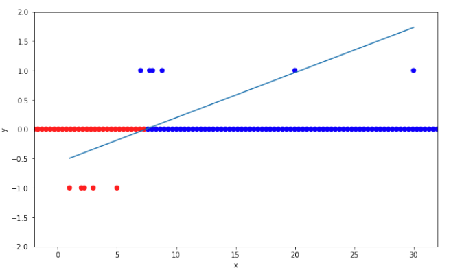
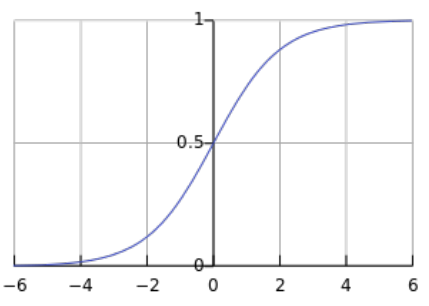
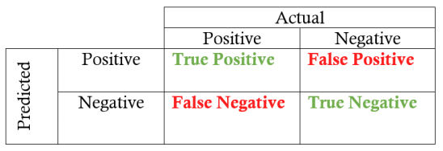
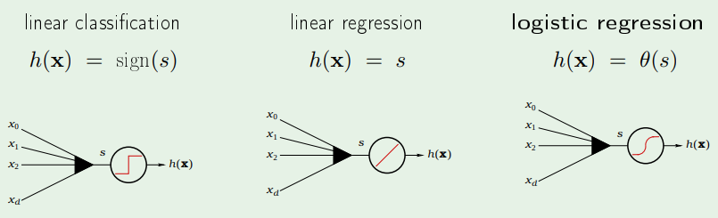
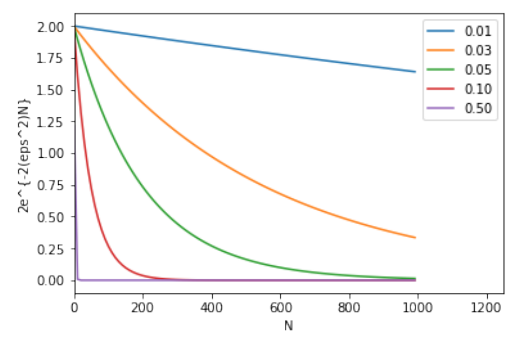
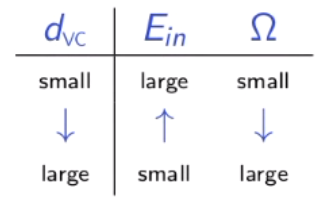
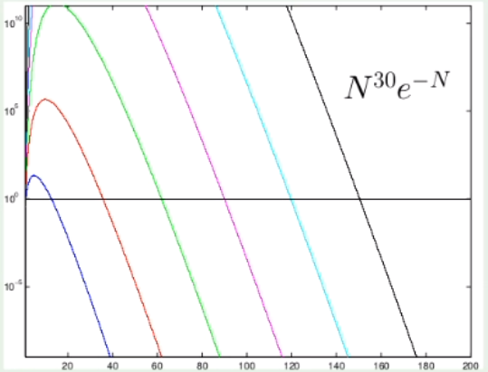
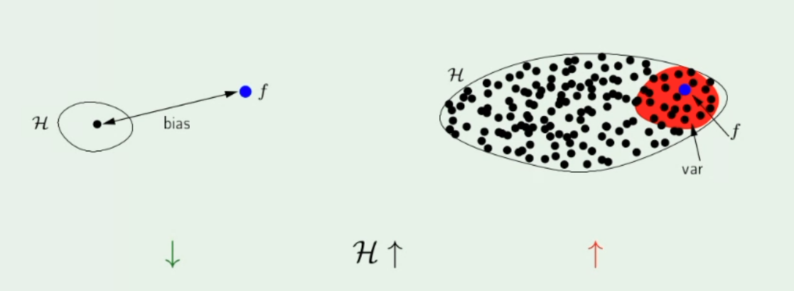
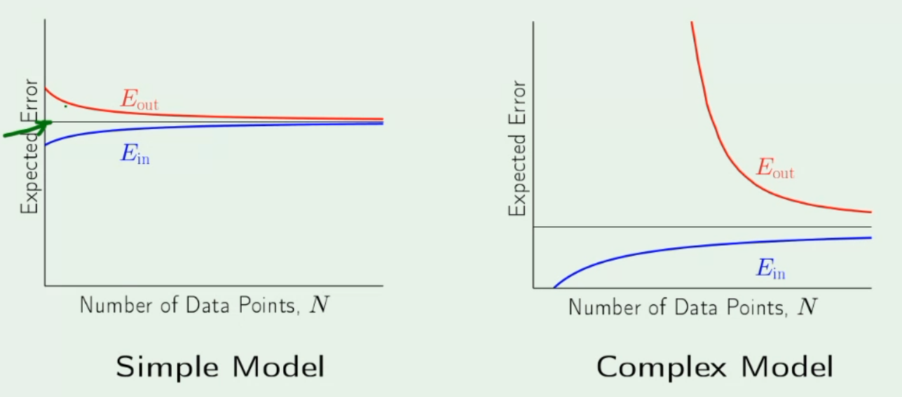
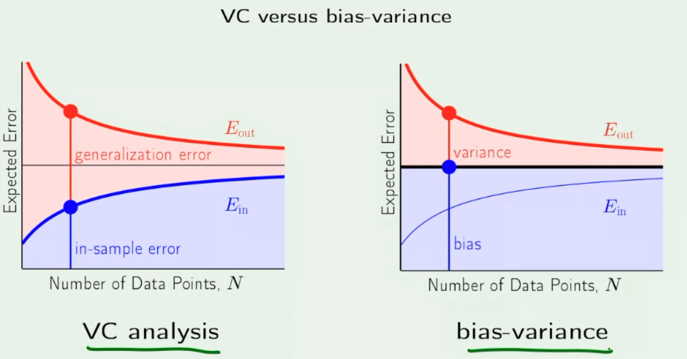

# MAC0460 - Introdução ao Aprendizado de Máquina

Oferecimento da disciplina no primeiro semestre de 2021, com a professora Nina S. T. Hirata, no Instituto de Matemática e Estatística da USP.

**Bibliografia**

- **Book:** Abu-Mostafa et al. *Learning from Data,* 2012
- [*Machine Learning* online course (MOOC)](https://work.caltech.edu/telecourse.html) — Caltech (video-lectures, slides)

**Avaliação**

- EPs
- Exercícios escritos
- QTs: Tarefas rápidas (~10% da nota final)

## Introdução

### O que é Machine Learning?

- Inteligência artificial
- Data Science
  - The fourth paradigm
  - Big data (5V: volume, velocity, variety, veracity, value)
  - Deep learning

Machine learning é parte de inteligência artificial e data science.

### Sob uma perspectiva computacional...

Computadores processam dados de acordo com algoritmos, e algoritmos são soluções para problemas computacionais. Em machine learning lidaremos com relações de *input-output* com dados complexos, casos ambíguos e dados que mudam frequentemente. Em geral **é difícil criar um algoritmo, mas fácil de listar pares *input-output***.

Em vez de escrever um código específico, podemos considerar um **modelo genérico para mapear entradas e saídas**, ajustando seus parâmetros a partir de dados de treinamento disponíveis.

Sob um ponto de vista puramente computacional, machine learning é uma abordagem de meta-programação.

## Problemas de machine learning

### Assumimos...

- Disponibilidade de exemplos de entrada-saída: $(x^{(n)}, y^{(n)}), n=1, \dots, N$
- A existência de uma relação plausível entre $x$ e $y$

### Problemas que gostaríamos de resolver:

Encontrar um mapeamento (programa de computador) que leva $x$ a $y$. Discutiremos **regressão** e **classificação**.

Técnicas de ML utilizadas para resolver problemas típicos de regressão e classificação costumam ser chamados **supervisionadas**. Supervisão se refere ao fato de que a saída $y$ esperada é conhecida para cada observação $x$ no conjunto exemplo de entrada.

A saída esperada $y$ é utilizada em algoritmos de ML para guiar o processo de aprendizado *(por isso se chama "supervisionado")*. 

### Problemas de regressão

$y$ é uma variável contínua $\implies$ o problema é de **regressão**

Encontrando $f$ tal que $y=f(x)$: podemos escolher $f(x; w, b) = wx + b$, com $w, b$ parâmetros do modelo *(para simplificar, vamos tentar uma função afim)*.

#### Formalizando...

Dado um conjunto de treinamento $\{(x^{(n)}, y^{(n)}): n = 1, \dots, N\}$ e a família $\mathcal{F} = \{f(x) = wx + b:w, x, b \in \mathbb{R} \}$, escolha $f^* \in \mathcal{F}$ (ou $w$ e $b$) tal que $f^*(x^{(n)})=y^{(n)},  n=1, ...,N$. Isso é possível? **NÃO!**

Então vamos encontrar lha $f^* \in \mathcal{F}$ (ou $w$ e $b$) tal que $f^*(x^{(n)}) \approx y^{(n)},  n=1, ...,N$.

Portanto, precisamos medir quão perto $f^*(x^{(n)})$ está de $y^{(n)}$.

Definindo o que deve ser minimizado *(a média do erro considerando todas as amostras)*:
$$
J(w,b) = \frac{1}{N} \sum^{N}_{n=1}{l((wx^{(n)}+b), y^{(n)})}
$$
Tal que a função de perda é $l(a,b) = (a-b)^2$ *(este é o erro quadrático, que a gente escolheu agora).*

Então temos o **Mean Squared Error (MSE)**:
$$
J(w,b) = \frac{1}{N} \sum^{N}_{n=1}{((wx^{(n)}+b) - y^{(n)})^2}
$$
É um problema de otimização: queremos minimizar o erro! Quando encontrarmos a função ótima $f^*$, podemos predizer saídas $y$ com novas entradas $x$.

### Problemas de classificação

$y$ é categórica $\implies$ o problema é de **classificação**

É necessário encontrar a relação entre $x$ e $y$. Podemos procurar (estimar) uma **distribuição de probabilidade**. 

#### Abordagem estatística

Teorema de Bayes:
$$
P(y|x) = \frac{P(y)P(x|y)}{P(x)}
$$
Se sabemos as distribuições, temos a *winning rule*:
$$
y^*= \arg\max_{y}{P(y|x)}
$$
E se não tivermos as distribuições? Temos apenas as observações *(nem sempre dá pra fazer a estimação da distribuição de probabilidade)*. Podemos definir um **ponto** que divide a reta de observações e delimita categorias.

E em um input **bidimensional** $x=(x_1, x_2)$? Agora, em vez de um ponto, podemos usar uma **reta** para delimitar as categorias.

Uma reta $w_1x_1 + w_2x_2 + b = 0$ para dividir o espaço no $\mathbb{R}^2$ em duas regiões e declarar:

​	Para um dado $x = (x_1, x_2)$,

​		se $w_1x_1 + w_2x_2 + b > 0 \implies y = $ *categoria 1*

​		se  $w_1x_1 + w_2x_2 + b < 0 \implies y = $ *categoria 2*.

**Fronteira de decisão:** poderíamos polinômios em vez de funções lineares. Novamente, qual família de mapeamentos que deveríamos escolher? Como determinar o valor ótimo desses parâmetros?

### Estatística X Machine Learning

Abordagens:

1. Foco na distribuição de $x$ *(prevalece na estatística)*

   - ABORDAGEM **GERATIVA**
2. Foco na saída esperada $P(y|x)$ *(prevalece em ML)*

   - ABORDAGEM **DISCRIMINATIVA**
- APRENDIZADO LIVRE DE DISTRIBUIÇÃO

### Superfície de decisão

- E se os pontos não forem repartíveis por uma reta?
  - Gaussiana 2D: linhas de contorno (distribuição simétrica)
    - Duas normais formam um sino
    - Medir matriz de covariância
- Tem relação com a distribuição de probabilidade (na prática não conseguimos estimar)

#### Distribuição normal

- Casos em que a fronteira é uma reta
  - $\Sigma_j = \sigma^2I$: ambas as classes têm a mesma matriz de covariância, covariância nula ($\sigma_{ii}=\sigma_{jj}$) -- distribuição simétrica
  - $\Sigma_j=\Sigma$: ambas as classes têm a mesma matriz de covariância

- Casos em que a fronteira não é uma reta
  - $\Sigma_j$ arbitrário: classes têm matrizes de covariância distintas

- Em **classificação binária**, se as duas classes têm distribuição normal com a **mesma matriz de covariância**, então a superfície de decisão ótima é um **hiperplano**

## Perceptron

- Encontra um hiperplano separador quando as classes são linearmente separáveis

INPUT: $x = (x_1, x_2, \dots, x_d) \in \mathbb{R}^d$

OUTPUT: $y \in \{-1, +1 \}$

HIPÓTESE: $h(x)= sign((\sum^d_{i=1}{w_ix_i})+b),  b \in \mathbb{R}, w_i \in \mathbb{R}, i = 1, 2, \dots, d$

Componente artificial, apenas para simplificar a notação:
$$
x = (1, x_1, x_2,  \dots, x_d) \in \mathbb{R}^{d+1} \\
w = (w_0, w_1, w_2,  \dots, w_d) \in \mathbb{R}^{d+1}
$$
Portanto 
$$
h(x) = sign(w^Tx) \ \ \ \ \ (w^Tx=0 \text{ define um hiperplano})
$$

### Algoritmo

Seja $w$ o peso "atual"

Seja $\mathcal{D}= \{(x^{(i)}, y^{(i)}), i = 1, \dots, N \}$ o conjunto de treinamento 

Repita:

 1. Seja $(x^{(i)}, y^{(i)}) \in \mathcal{D} $ tal que $sign(w^Tx^{(i)}) \neq y^{(i)}$. Se não houver tal par, então pare.

 2. Atualize o peso atual conforme: 

    $w \leftarrow w + y^{(i)}x^{(i)}, y^{(i)} \in \{ -1, +1 \}$

Devolva $w$

### Intuição

### Convergência do algoritmo perceptron

Assumimos...

- Duas classes são **linearmente separáveis** se existe um hiperplano separador com margem $\gamma$ -- existe um vetor de pesos $w$ com norma 1 ($\|w\|=1$) tal que $y^{(i)}w^Tx^{(i)}>\gamma, \forall i$

- Tome também $R$ como sendo a **máxima norma** dos exemplos $x^{(i)} \in \mathcal{D}$

- Tome $k$ como o **número de iterações** do algoritmo

A prova consiste em mostrar que $k$ é limitado por $\mathcal{O}(R^2/\gamma^2)$

​	**(1)** 			$\|w^{k+1}\| > k \gamma$

​	**(2)** 			$\| w^{k+1} \|^2 \leq kR^2$

​	**(1) + (2)**    $k^2\gamma^2< \| w^{k+1} \|^2 \leq kR^2 \implies k < \frac{R^2}{\gamma^2}$, que é finito

### Observações

- Pocket algorithm

## Regressão Linear

### MSE: função de custo/perda

- A função de custo é quadrática, então é convexa
  $$
  J(w_0,w_1) = \frac{1}{N} \sum^{N}_{n=1}{(\hat{y}^{(n)} - y^{(n)})^2}, \\ \hat{y}^{(n)} = h(x^{(n)})=w_0+w_1 x^{(n)}
  $$

- Portanto, ela tem mínimo global

### Solução analítica

**Solução:** $d = 1$ 
$$
J(w_0,w_1) = \frac{1}{N} \sum^{N}_{n=1}{(w_0+w_1 x^{(n)} - y^{(n)})^2}
$$
Derivadas parciais:
$$
\frac{\partial J(w_0,w_1)}{\partial w_0} = 2 \sum^N_ {n=1}(w_0+w_1x^{(n)}-y^{(n)})
\\
\frac{\partial J(w_0,w_1)}{\partial w_1} = 2 \sum^N_ {n=1}(w_0+w_1x^{(n)}-y^{(n)})x^{(n)}
$$
Ponto mínimo de $J(w_0, w_1)$:
$$
w_0 = \bar{y} - w_1 \bar{x}\\
w_1 = \frac{\sum^N_{n=1}(x^{(n)}-\bar{x})(y^{(n)}-\bar{y})}{\sum^N_{n=1}(x^{(n)}-\bar{x})^2}
$$
**Notação:** caso $d$-dimensional ($d>1$)
$$
x^{(n)} = (1, x_1, x_2, \dots, x_d) \in \{1\} \times \mathbb{R}^d \rightarrow \text{ array } (d+1, 1) \\
w = (w_0, w_1, w_2, \dots, w_d) \in \mathbb{R}^{d+1} \rightarrow \text{ array } (d+1, 1)
$$

$$
h_w(x^{(n)}) = \sum^d_{i=0}w_ix_i = \begin{bmatrix} w_0 & w_1 & \dots & w_d \end{bmatrix} \begin{bmatrix} 1 \\ x_1 \\ \vdots \\ x_d \end{bmatrix} = w^Tx^{(n)}\\
J(w) = \frac{1}{N} \sum^N_{n=1}(h_w(x^{(n)})-y^{(n)})^2
$$

**initSolução baseada em álgebra de matrizes**

Função de custo: $J(w) = \frac{1}{N} \sum^N_{n=1}(h_w(x^{(n)})-y^{(n)})^2$

Resíduos:

Portanto, o vetor de resíduos pode ser expresso como
$$
\begin{bmatrix}
h_w(x^{(1)})-y^{(1)} \\
h_w(x^{(2)})-y^{(2)} \\
\vdots \\
h_w(x^{(N)})-y^{(N)} \\
\end{bmatrix}
=
Xw-y
$$
Nós precisamos do quadrado dos resíduos:
$$
\begin{bmatrix}
(h_w(x_1)-y_1)^2 \\
(h_w(x_2)-y_2)^2 \\
\vdots \\
(h_w(x_N)-y_N)^2 \\
\end{bmatrix}
=
(Xw-y)^T(Xw-y)
$$
Que pode ser expresso como $\|Xw-y\|^2$

Minimizando $J$:
$$
J(w) = \frac{1}{N}\|Xw-y\|^2 \\
\nabla J(w) = \frac{2}{N}X^T(Xw-y)=0 \\
X^TXw = X^Ty \\
w = X^\dagger y, \text{ onde } X^\dagger = (X^TX)^{-1}X^T
$$
$X^\dagger$ é a "pseudo-inversa" de $X$

### O algoritmo de regressão linear

1. Construa a matriz $X$ e o vetor $y$ do conjunto de dados $(x_1, y_1), \dots, (x_N, y_N)$ , na forma:
   $$
   X = \begin{bmatrix} - x_ 1^T- \\ - x_2^T - \\ \vdots \\ - x_N^T - \end{bmatrix},\ \ y =  \begin{bmatrix} y_1 \\ y_2 \\ \vdots \\ y_N \end{bmatrix}.
   $$
   
2. Compute a pseudo-inversa $X^\dagger = (X^TX)^{-1}X^T$

3. Devolva $w = X^\dagger y$

**Custo computacional**

- Solução: $w = (X^TX)^{-1}X^Ty$

- Precisamos computar a inversa de $X^TX$ (dimensão $(d+1) \ times (d+1)$) $\rightarrow$ muito caro!

- Complexidade da inversão de matriz: cúbica
- A computação de $X^TX$também é cara ($N$ pode ser muito grande)

### Gradiente Descendente

Seja $J(w)$ a função custo a ser minimizada

**Pseudocódigo:**

1. Inicialize $w$ (tipicamente com valores pequenos aleatórios)
2. Itere até algum critério de parada ser obedecido
   1. Compute o gradiente de $J$ em $w$ ("direção de crescimento mais rápido")
   2. Atualize $w$ na direção negativa do gradiente

**Exemplo: função de custo MSE**
$$
J(w) = \frac{1}{N} \sum^N_{n=1}( \underbrace{h_w(x^{(n)})}_{\hat{y}^{(n)}=w^Tx^{(n)}} - y^{(n)})^2
$$
Vetor gradiente de $J$:
$$
\nabla J(w) = \begin{bmatrix} \frac{\partial J}{\partial w_0}, \frac{\partial J}{\partial w_1}, \dots, \frac{\partial J}{\partial w_d} \end{bmatrix}^T
$$

$$
\frac{\partial J}{\partial w_j} = \sum_n(\hat{y}^{(n)}- y^{(n)})x_j^{(n)}
$$
**Técnica do gradiente descendente** 

1. Peso inicial: $w(0)$
2. Regra de atualização de peso ($r$-ésima iteração):
   1. $w(r+1) = w(r) + \eta \Delta w(r)$
   2. $\Delta w(r) = - \nabla J(w), \Delta w_j(r) = \sum_n (y^{(n)}- \hat{y})x_j^{(n)}$

($\eta$: taxa de aprendizado - geralmente um valor pequeno, como $0.001$)

#### Gradiente descendente - Batch

$$
\begin{align}
& \textbf{Input: } D, \eta, \textit{épocas} \\
& \textbf{Output: } w \\
& \quad w \leftarrow \text{pequeno valor aleatório} \\
& \quad \textbf{repita} \\
& \quad\quad \Delta w_j \leftarrow 0,\ j = 0, 1, 2, \dots, d \\
& \quad\quad \textbf{para todo } (x, y) \in D \textbf{ faça} \\
& \quad\quad\quad \text{compute } \hat{y} = w^Tx \\
& \quad\quad\quad \Delta w_j \leftarrow \Delta w_j + (y - \hat{y})x_j,\ j = 0, 1, 2, \dots, d \\
& \quad\quad \textbf{fim} \\
& \quad\quad w_j \leftarrow w_j + \eta \Delta w_j,\ j = 0, 1, 2, \dots, d \\
& \quad \textbf{até que } \text{número de iterações} = \textit{épocas} 
\end{align}
$$

#### Gradiente descendente estocástico

$$
\begin{align}
& \textbf{Input: } D, \eta, \textit{épocas} \\
& \textbf{Output: } w \\
& \quad w \leftarrow \text{pequeno valor aleatório} \\
& \quad \textbf{repita} \\
& \quad\quad \textbf{para todo } (x, y) \in D \textbf{ faça} \\
& \quad\quad\quad \text{compute } \hat{y} = w^Tx \\
& \quad\quad\quad \Delta w_j \leftarrow \Delta w_j + \eta(y - \hat{y})x_j,\ j = 0, 1, 2, \dots, d \\
& \quad\quad \textbf{fim} \\
& \quad \textbf{até que } \text{número de iterações} = \textit{épocas} 
\end{align}
$$

#### Gradiente descendente com Mini-batch

- Batch: $\Delta w_j(r) = \sum_n (y^{(n)} - \hat{y}^{(n)}) x_j^{(n)}$
  - Utiliza todas as amostras em cada iteração quando está atualizando parâmetros
  - Para cada atualização, temos que somar todas as amostras
- Estocástico: $\Delta w_j(r) = (y^{(n)} - \hat{y}^{(n)})x_j^{(n)}$
  - Em vez de utilizar todas as amostras, o método estocástico atualiza os parâmetros a cada amostra visitada
  - O aprendizado ocorre em cada amostra

- Mini-batch: entre os dois
  - Em vez de utilizar todas as amostras, o mini-batch utiliza um número menor de amostras, baseado no *batch-size*
  - O aprendizado ocorre em cada mini-batch

#### Passo com tamanho fixo?

Como $\eta$ afeta o algoritmo:

$\eta$ deve aumentar com a  inclinação

#### Coeficiente de determinação

- Medida utilizada para avaliar o quão bom é o *fit* do modelo

$$
R^2 = 1 - \frac{SS_{res}}{SS_{tot}}
$$

- Quanto melhor a regressão linear (gráfico à direita) se encaixar nos dados em comparação com a média simples (gráfico à esquerda), $R^2$ ficará mais perto de $1$
- As áreas dos quadrados azuis representam os resíduos ao quadrado, à respeito da regressão linear
- As áreas dos quadrados vermelhos representam os resíduos ao quadrado, à respeito do valor médio

## Regressão logística

- Abordagem estatística (teorema de Bayes)

### Classificação binária

- Como utilizar **regressão linear** para classificação binária?

  - Sejam os negativos definidos por $y=-1$ e os positivos por $y=+1$

  - Podemos determinar $h_w(x)=w^Tx$ e utilizar $\hat{y}= sign (w^Tx)$

  - Aproxima mais ou menos bem a fronteira de decisão

  - **Problema**: deslocamento para um lado, dependendo de como os dados estão espalhados

    

    Exemplos positivos mais a direita contribuem para um erro maior, e exemplos positivos mais à esquerda serão classificados como negativos

### Distribuição *target*

- ***Targets* ruidosos**

  - Exemplos que não são perfeitamente separáveis — a "*target function*" nem sempre é uma função

- Como discutimos, do Teorema de Bayes, sabemos que: $P(y|x)=\frac{P(y)p(x|y)}{p(x)}$

  - Então, em vez de tentar adivinhar $y$, por que não estimar $P(y|x)$?
  - Em vez de $y=f(x)$, nosso alvo será a distribuição $P(y|x)$

- Assumindo que a nossa target é $f(x)=P(y=+1|x)$

  - Podemos escrever $P(y|x) = \cases{f(x), \text{ if } y=+1, \\ 1 - f(x), \text{ if } y=-1}$
  - Note que não temos acesso a $f(x)$, nós só sabemos que $y$ vem de uma distribuição desconhecida $P(y|x)$
  - Mas, se formos capazes de "aprender" $f(x)$, seremos capazes de saber $P(y|x)$

- **Escolhendo um espaço de hipóteses...**

  - Como o nosso *target* é tal que $0 \leq f(x) \leq 1$, vamos considerar hipóteses de mesmo tipo: $h_w(x)= \theta (w^T x)$ 
  - Tal que $\theta$ é a função sigmoide: $\theta(z) = \frac{1}{1+e ^{-z}} = \frac{e^z}{e^z+1}$
    - $0 \leq \theta (z) \leq 1 \implies 0 \leq h_w(x) \leq 1$

  

  - Se $h_w(x) \approx f(x)$, então $P(y|x) = \cases{h_w(x), \text{ if } y=+1, \\ 1 - h_w(x), \text{ if } y=-1}$ deve ser um bom estimador de $P(y|x)$
  - Para evitar lidar separadamente com os dois casos, $y=+1$ e $y=-1$, note que $1 - \theta(z) = \theta(-z)$
  - Usando este fato mais $h_w(x)=\theta(w^Tx)$, podemos escrever $P_w(y|x) = \theta(yw^Tx)$

- **Aprendendo a função *target*...**

  - Dados de treinamento disponíveis: $\mathcal{D} = \{ (x^{(n)}, y^{(n)}) \in X \times Y, n= 1, \dots, N\}$
  - Esses exemplos seguem como uma distribuição desconhecida $P(x,y)$
  - $y$ segue a distribuição $P(y|x)$
  - Dentre todas as distribuições $P_w(y|x) = \theta (yw^Tx)$, qual $w$ melhor aproxima $P(y|x)$?

### Função de verossimilhança

- Adivinhar qual é a distribuição que deu origem a essas amostras $\rightarrow$ encontrar a distribuição que maximiza a probabilidade de observar aquelas amostras

- **Estimação de máxima verossimilhança**

  - Assumimos uma distribuição paramétrica e encontramos os parâmetros que correspondem à distribuição que maximiza a probabilidade de observar os exemplos realmente observados

  - Em nossa configuração, dentre todas as distribuições $P_w(y|x) = \theta(yw^Tx)$ (parâmetro $w$), qual é aquele que maximiza a probabilidade de observar os exemplos em $\mathcal{D}$?

  - Assumindo que os exemplos em $\mathcal{D}$ são independentes e identicamente distribuídos, a **função de verossimilhança** pode ser escrita como:
    $$
    \prod_{n=1}^N P_w(y^{(n)}|x^{(n)}) = \prod_{n=1}^N \theta(y^{(n)} w^T x^{(n)})
    $$

- **Problema de otimização**

  - Encontrar $w$ que maximiza $\prod_{n=1}^N \theta(y^{(n)} w^T x^{(n)})$

  - Ou, equivalentemente, que maximiza $\frac{1}{N} \ln (\prod_{n=1}^N \theta(y^{(n)} w^T x^{(n)}))$

  - Ou, equivalentemente, que minimiza:
    $$
    -\frac{1}{N} \ln (\prod_{n=1}^N \theta(y^{(n)} w^T x^{(n)}))  =
    -\frac{1}{N} \sum_{n=1}^N  \ln (\theta(y^{(n)} w^T x^{(n)})) \\ =
    \frac{1}{N} \sum_{n=1}^N  \ln (\frac{1}{\theta(y^{(n)} w^T x^{(n)})}) =
    \frac{1}{N} \sum_{n=1}^N \ln(1+e^{-y^{(n)}w^Tx^{(n)}})
    $$

- **Regressão logística**

  - Função de perda a ser minimizada:
    $$
    E_{in} = \frac{1}{N} \sum^N_{n=1} \underbrace{\ln(1+e^{-y^{(n)}w^Tx^{(n)}})}_{err(y^{(n)}, \hat{y}^{(n)})}
    $$

  - Interpretação:

    - Se os sinais de $y^{(n)}$ e $w^Tx^{(n)}$ concordam, o expoente em $e^{-y^{(n)}w^Tx^{(n)}}$ é negativo $\implies err(y^{(n)}, \hat{y}^{(n)})$ tende a se aproximar de zero
    - Se os sinais de $y^{(n)}$ e $w^Tx^{(n)}$ discordam, o expoente em $e^{-y^{(n)}w^Tx^{(n)}}$ é positivo $\implies err(y^{(n)}, \hat{y}^{(n)})$ tende a ser grande

- **Observações:**

  - $y^{(n)} \in \{ -1, +1 \}$ enquanto $\hat{y}^{(n)} \in [0,1]$
    - Nós usamos $\hat{y}^{(n)}$ para indicar que esta é a saída do algoritmo, mas isso pode não ser o mais adequado já que $\hat{y}^{(n)} = \theta(w^Tx) = P_w (y= +1|x^{(n)})$
    - É por isso que o método é chamado **regressão** logística
  - A formulação que vimos assume $y \in \{ -1, +1 \}$
  - Uma formulação mais comum (?) assume $y \in \{0,1\}$

#### Classificação de erros

- É conveniente que o algoritmo de regressão logística tenha como saída $\hat{y}^{(n)} = \theta(w^Tx) = P_w (y= +1|x^{(n)})$

- **Tipos de classificações de erros:**

  

- Você pode decidir classificar $x^{(n)}$ como positivo somente se $P_w (y= +1|x^{(n)}) \geq 0.8$

  - Por outro lado, $P_w (y= +1|x^{(n)}) \geq 0.3$ pode fazer mais sentido em outros casos
  - O tipo de erro pode ter custos associados

#### Classes desbalanceadas

- Se tivermos muitas observações de uma classe, ela pode desbalancear o modelo
- É importante considerar esse fenômeno no design de classificadores

#### Perda *cross-entropy*

- Formulação quando usamos $Y = \{0,1\}$ em vez de  $Y = \{-1,+1\}$
- Um truque para escrever $P(y|x)$ como uma única equação:

$$
P(y|x) = P(y=1|x)^y P(y=0|x)^{1-y} = P(y=1|x)^y [1 - P(y=1|x)]^{1-y}
$$

- Função de verossimilhança (índice $(n)$ omitido para uma notação mais clara):
  $$
  \begin{align}
  \prod_{(x,y) \in \mathcal{D}} P(y|x) & = \prod_{(x,y) \in \mathcal{D}} P(y=1|x)^y [1 - P(y=1|x)]^{1-y} \\
  & \approx \prod_{(x,y) \in \mathcal{D}}  [\theta(w^Tx)]^y [1 - \theta(w^Tx)]^{1-y} \\
  & = \prod_{(x,y) \in \mathcal{D}} \hat{y}^y (1- \hat{y})^{1-y}
  \end{align}
  $$

- O problema de maximizar a função de verossimilhança acima é equivalente a minimizar a seguinte expressão:
  $$
  \begin{align}
  & -\ln \prod_{(x,y) \in \mathcal{D}} \hat{y}^y (1- \hat{y})^{1-y} = -\sum_{(x,y) \in \mathcal{D}} \ln(\hat{y}^y (1- \hat{y})^{1-y}) \\
  & = -\sum_{(x,y) \in \mathcal{D}} \ln(\hat{y}^y) + \ln((1- \hat{y})^{1-y}) = -\sum_{(x,y) \in \mathcal{D}} y\ln\hat{y} + (1-y)\ln(1- \hat{y})
  \end{align}
  $$

- ***Cross-entropy loss:***

$$
J(w) = -\frac{1}{N} \sum^N_{n=1} y^{(n)} \ln \hat{y}^{(n)} + (1 - y^{(n)}) \ln(1 - \hat{y}^{(n)}), \text{ onde } \hat{y}^{(n)} = \theta(w^Tx)
$$

​		Dadas duas distribuição $p$ e $q$ sobre $A$, *cross-entropy* é definida como: $H(p,q) = - \sum_{a \in A} p(a) \log q(a)$

### Otimização

- Utilizamos o gradiente descendente para otimizar ambas as formulações:

#### Para $Y = \{-1,+1\}:$

​	Fórmula: $E_{in} = \frac{1}{N} \sum^N_{n=1} \ln(1+e^{-y^{(n)}w^Tx^{(n)}})$

​	Gradiente: $\frac{\partial}{\partial w} [\ln(1+e^{-y^{(n)}w^Tx^{(n)}})]= ?$

​	Denote $s=-yx$. Então $\frac{\partial}{\partial w} [\ln(1+e^{w^Ts})]= ?$

​	Como $\frac{\partial}{\partial w} [\ln[f(x)]] = \frac{f'(x)}{f(x)}$, então
$$
\frac{\partial}{\partial w} [\ln(1 + e^{w^T s})]= \frac{(1 + e^{w^T s})'}{1 + e^{w^T s}} = \frac{s e^{w^T s}}{1 + e^{w^T s}} = s \frac{e^{w^T s}}{1 + e^{w^T s}} = s \frac{1}{1 + e^{-w^T s}}
$$
​	Portanto, 
$$
\frac{\partial}{\partial w} [\ln(1 + e^{-y w^T x})] = -\frac{yx}{1 + e^{y w^T x}}
$$

#### Para $Y = \{0,1\}:$

​	Fórmula: $J(w) = -\frac{1}{N} \sum^N_{n=1} y^{(n)} \ln \hat{y}^{(n)} + (1 - y^{(n)}) \ln(1 - \hat{y}^{(n)})$
$$
\hat{y}^{(n)} = h_w(x) = \theta(w^T x) = \frac{1}{1 + e^{-w^Tx}}
$$
​	Derivadas parciais: $\frac{\partial}{\partial w_j} J(w) = \sum^N_{n=1} (\hat{y}^{(n)} - y^{(n)})x_j^{(n)}$

​	Atualização dos pesos: $\Delta w_j(r) =  \sum^N_{n=1} (y^{(n)} - \hat{y}^{(n)})x_j^{(i)}$

### Um terceiro modelo linear

$$
s = \sum^d_{i=0} w_i x_i
$$

## Is learning feasible?

- Como a hipótese escolhida $g$ vai se comportar fora do conjunto de treinamento (no mundo real)?
  - Aprender X Memorizar
- **Fato**: a função $f$ é deseconhecida
- Não há garantia de que escolheremos o $g$ correto para $f$
- Conseguimos escolher uma hipótese $g$ que tem um erro pequeno?
- Nosso objetivo é escolher o $g \in \mathcal{H}$ ótimo, com mínimo $E_{out}(g)= \mathbb{E} [Err(y, g(x))]$ (Erro esperado $p(x,y)$)
- Escolhemos $g$ baseado em $E_{out} = $
- **ERROS**
  - Erro empírico $E_{in}$ (estávamos chamando de $J$)
  - Erro verdadeiro $E_{out}$
- **QUESTÃO:** $E_{in}(g)$ diz algo sobre $E_{out}(g)$?

### Uma visão probabilística

#### Problema: urna com bolas de gude verdes e vermelhas

- $\mu = $ probabilidade de bolinhas vermelhas ($E_{out}$)
- Dada uma amostra de $N$ bolinhas (escolhidas independentemente), temos $\nu =$ fração de bolinhas vermelhas ($E_{in}$)
- $\mathbb{P} [\text{escolher uma bolinha vermelha}] = \mu$
- $\mathbb{P} [\text{escolher uma bolinha vermde}] = 1-\mu$
- $\nu$ diz algo sobre $\mu$?
  - Não! A amostra pode ser majoritariamente verde enquanto a urna é majoritariamente vermelha
  - Sim! A frequência da amostra $\nu$ é provavelmente próxima à frequência da urna $\mu$
- Possível X provável
- $\nu$ é uma estimativa de $\mu$: é boa o suficiente? $|\nu-\mu|$ é pequeno?
- **Teorema do Limite Central**
  - Tome amostras de tamanho $N$ e compute a fração de bolinhas vermelhas $\nu$
  - Repita várias vezes
  - A distribuição de $\nu$ será uma ditribuição normal com média $\mu$
  - Quanto maior o $N$, menor o desvio padrão de $\nu$

- Outras "leis" que estabelecem uma relação entre $\nu$ e $\mu$:

  - **Desigualdade de Hoeffding**

    $P(|\nu - \mu|> \epsilon) \leq 2e^{-2 \epsilon^2 N}$

    - Limita a probabilidade de ter uma estimativa ruim, relacionada ao tamanho da amostra $(N)$

    - Bound variation em função de $N$:

      

- Conceitualmente, podemos colorir cada $x \in \mathcal{X}$:
  - verde se $h(x) = f(x)$
  - vermelho se $h(x) \neq f(x)$
- $E_{out}(h)$é a fração de instâncias vermelhas em $\mathcal{X}$
- $E_{in}(h) $ é a fração de instâncias vermelhas em $\mathcal{D}$

- $E_{out}(h)$ = parâmetro desconhecido
- $E_{in}(h) $ = estimativa de $E_{out}(h)$
- $|E_{in}(h) - E_{out}(h)| > \epsilon $??

#### Dada uma hipótese $h$ qualquer...

- Generalizando, temos:

  $\mathbb{P}(|E_{in}(h) - E_{out}(h)|> \epsilon) \leq 2e^{-2 \epsilon^2 N}$

- **Problema**: a fórmula só funciona para um certo $h$ fixo

  - Essa é uma "verificação" de $h$, não learning
  - Em geral fazemos uma escolha de $h$

- Múltiplas urnas: $h_1, h_2, \dots, h_M$
  - $E_{in}(h_1), E_{in}(h_2), \dots, E_{in}(h_M)$
  - $E_{out}(h_1), E_{out}(h_2), \dots, E_{out}(h_M)$
- Não podemos simplesmente aplicar Hoeffding à hipótese escolhida $g$, porque $g$ não é uma hipótese fixada, é escolhida

#### Hoeffding no contexto de ML

- Devemos considerar a probabilidade de algumas hipóteses $h_m$ ser tal que $|E_{in}(h_m) - E_{out}(h_m)|> \epsilon$

- Se tivermos $M$ hipóteses $h_1, h_2, \dots, h_M$ e escolhermos uma, que nós denotamos como $g$,
  $$
  \begin{align}
  \mathbb{P}[|E_{in}(g) - E_{out}(g)|> \epsilon] & \leq \mathbb{P}[|E_{in}(h_1) - E_{out}(h_1)|> \epsilon \text{ or }  |E_{in}(h_2) - E_{out}(h_2)|> \epsilon \text{ or } \dots \text{ or } |E_{in}(h_M) - E_{out}(h_M)|> \epsilon]  \\
  & \leq \sum^M_{m=1} \mathbb{P}[|E_{in}(h_m) - E_{out}(h_m)|> \epsilon] \\
  & \leq 2e^{-2 \epsilon^2 N}
  \end{align}
  $$

- Portanto, temos:
  $$
  P(|E_{in}(g) - E_{out}(g)|> \epsilon) \leq 2Me^{-2 \epsilon^2N}
  $$

- **Consistente** com a nossa intuição:

  - exponencial negativo $\rightarrow$ quanto maior o $N$, menor o bound

- **Contrário** a nossa intuição:

  - o tamanho do conjunto de hipóteses $M$ $\rightarrow$ quando maior o espaço de hipóteses $\mathcal{H}$, maior o bound
  - questão: então deveríamos escolher um espaço de hipóteses pequeno?
  
- As boas notícias: podemos fazer o limite de Hoeffding ser arbitrariamente pequeno (**cenário de verificação**)

- Se $M$ é inifinito, o limite será grande ­— sem significado (**cenário de aprendizado**)

  - Podemos trocar o $M$ por um valor **finito**?

#### Podemos melhorar $M$?

- $M$ veio de várias uniões de probabilidade

- Porém eventos ruins têm muitos overlaps

  - $\Delta E_{out}$: mudança nas áreas $+1$ e $-1$
  - $\Delta E_{in}$: mudança nas labels dos pontos dados

- $|E_{in}(h_1) - E_{out}(h_1)| \approx |E_{in}(h_2) - E_{out}(h_2)|$

- **A escolha de $g$ a partir de $\mathcal{H}$ é afetada por $D$ (dados de treinamento)**

  - Geralmente, há muitas hipóteses $h_j$ similares que classificam as amostras $D$ da mesma maneira

  - a

- Para melhorar o limite, vamos substituiur o *union bound* com um que leva em consideração overlaps

- Para isso, vamos **definir um "número"** que caracteriza a complexidade de $\mathcal{H}$

  - **Conceitos importantes:**
    - Dicotomia
    - Função de crescimento
    - Break point

### Dicotomia

- Em vez de considerar o espaço de entrada inteiro, consideramos um conjunto finito de pontos, e contamos o número de **dicotomias**

Seja $X = \{ x_1, x_2, \dots, x_N \}$ ($N$ pontos)

Seja $\mathcal{H}$ um espaço de hipóteses

**Uma dicotomia gerada por $\mathcal{H}$:** qualquer bipartição de $X$ como $X_{-1} \cup X_{+1}$ que obedece uma determinada hipótese $h \in \mathcal{H}$:
$$
\mathcal{H}(x_1, x_2, \dots, x_N) = \{ (h(x_1), h(x_2), \dots, h(x_N))\ |\ h \in \mathcal{H} \}
$$

#### Mini-hipóteses

- Uma hipótese: $h : \mathcal{X} \rightarrow \{ -1, +1\}$
- Uma dicotomia $h : \{x_1, x_2, \dots, x_N \} \rightarrow \{ -1, +1\}$
- Número de hipóteses $|\mathcal{H}|$ pode ser infinito
- Número de dicotomias $| \{x_1, x_2, \dots, x_N \} |$ é no máximo $2^N$
- Candidato para

**Por que o número de dicotomias $\mathcal{H}(x_1, x_2, \dots, x_N)$ é no máximo $2^N$?**

- Se você considerar outro conjunto de pontos, como $X' = \{x'_1, x'_2, \dots, x'_N \}$
  1. $\mathcal{H}(x_1, x_2, \dots, x_N) = \mathcal{H}(x'_1, x'_2, \dots, x'_N)$?
  2. $| \mathcal{H}(x_1, x_2, \dots, x_N) | = | \mathcal{H}(x'_1, x'_2, \dots, x'_N) |$?

### Função de crescimento (growth function)

A função de crescimento conta o **máximo** de dicotomias em quaisquer $N$ pontos
$$
m_{\mathcal{H}}(N) = \max_{x_1, \dots, x_n \in \mathcal{X}} |\mathcal{H} (x_1, \dots, x_N|
$$
A função de crescimento satisfaz: $m_{\mathcal{H}}(N) \leq 2^N$

1. **Exemplo:** para o perceptron

   - $m_{\mathcal{H}}(3) = 8$

   - $m_{\mathcal{H}}(4) = 14$ (o problema do *xor*)
   - $m_{\mathcal{H}}(N) = ?$

2. **Exemplo:** positive rays

   - $\mathcal{H}$ é um conjunto de $h: \mathbb{R} \rightarrow \{-1,+1\}$

   - $h(x)= sign(x-a)$
   - **$m_{\mathcal{H}}(N) = n+1$ (linear)**

3. **Exemplo:** positive intervals

   -  $\mathcal{H}$ é um conjunto de $h: \mathbb{R} \rightarrow \{-1,+1\}$

   - Coloque as extremidades em dois dos $N+1$ pontos

   - **$m_{\mathcal{H}}(N) = {N+1 \choose 2} + 1 = \frac{1}{2}N^2 + \frac{1}{2}N + 1$ (quadrático)**

4. **Exemplo:** conjuntos convexos

   -  $\mathcal{H}$ é um conjunto de $h: \mathbb{R}^2 \rightarrow \{-1,+1\}$
   - $h(x) = +1$ é convexo
   - **$m_{\mathcal{H}}(N) = 2^N$ (exponencial)**
   - Os $N$ pontos são "fragmentados" pelos conjuntos convexos

#### De volta à big picture...

Tínhamos a seguinte desigualdade: $\mathbb{P}(|E_{in}(g) - E_{out}(g)|> \epsilon) \leq 2Me^{-2 \epsilon^2N}$

- O que acontece se $m_{\mathcal{H}}$ substituir $M$? (O que ela diz sobre a expressividade do conjunto de hipóteses?)
- $m_{\mathcal{H}}(N)$ polinomial $\implies$ BOM!
- Basta provar que $m_{\mathcal{H}}(N)$ é polinomial? (Sem calcular explicitamente!)
  - Se a função de crescimento for polinomial, o limite pode ser arbitrariamente pequeno!

### Break point

Se nenhum conjunto de dados $D$ de tamanho $k$ pode ser fragmentado por $\mathcal{H}$ ($\mathcal{H}$ consegue gerar todas as dicotomias sobre os $N$ pontos), então $k$ é um **break point** para $\mathcal{H}$
$$
m_{\mathcal{H}}(k) < 2^k
$$

1. Para perceptrons 2D, $k=4$ ­— não conseguimos gerar todas as dicotomias sobre esse conjuntos de dados
2. Para o positive rays, break point $k=2$
3. Para o positive intervals, break point $k=3$
4. Para o convex sets, break point $k = \infty$

- Se o *break-point* for finito, então a função de crescimento é polinomial

### Provando que $m_{\mathcal{H}}(N)$ é polinomial

- Para provar que $m_{\mathcal{H}}(N)$ é polinomial, vamos mostrar que $m_{\mathcal{H}}(N) \leq \dots \leq \dots \leq$ um polinômio

- **Quantidade chave:** $B(N, k)$: número máximo de dicotomias de $N$ pontos, com *break-point* $k$

  -  Computar $B(N, k)$ é muito custoso, vamos limitar $B(N, k)$!

  - **Limite recursivo em $B(N, k)$**

    - Considere $B(N, k) = \alpha + 2 \beta$

      

      ($S_1$ não há repetições até $x_{N-1}$. $S_2$ há repetições até  $x_{N-1}$, sendo que $S_2^+$ tem $x_N$ positivo e $S_2^-$ tem $x_N$ negativo)

    - **Estimando $\alpha$ e $\beta$**:

      Focando nas $x_1, x_2, \dots, x_{N-1}$ colunas: 

      $\alpha + \beta \leq B(N-1, k)$ (isso ocorre porque $\alpha + \beta$ são linhas de dicotomias sobre $N-1$ pontos)

    - **Estimando $\beta$**:

      Agora, focando nas linhas $S_2 = S_2^+ \cup S_2^-$:

      $\beta \leq B(N-1, k-1)$ (isso ocorre porque $\beta$ não pode ser break-point $k$, afinal ele tem apenas $N-1$ pontos)

    - **Portanto...**

      $B(N, k) \leq B(N-1, k) + B(N-1, k-1)$ 

  - **Solução analítica para o limite de $B(N,k)$**

    **Teorema:** 
    $$
    B(N, k) \leq \sum^{k-1}_{i=0} {N \choose i} \\
    \sum^{k-1}_{i=0} {N \choose i} = \sum^{k-1}_{i=0} {N-1 \choose i} + \sum^{k-2}_{i=0} {N-1 \choose i}
    $$
    (Prova por indução omitida)

- **É POLINOMIAL!**

  Para um dado $\mathcal{H}$, o break-point $k$ é fixado
  $$
  m_{\mathcal{H}}(N) \leq \underbrace{\sum^{k-1}_{i=0} {N \choose i}}_{\text{máxima potência é }N^{k-1}}
  $$

- 3 exemplos:

  1. *positive rays* ($k = 2$)
     $$
     \begin{align}
     m_{\mathcal{H}}(N) = n + 1 \leq n + 1
     \end{align}
     $$
     
  2. *positive intervals* ($k = 3$)
     $$
     m_{\mathcal{H}}(N) = \frac{1}{2}N^2 + \frac{1}{2}N + 1 \leq \frac{1}{2}N^2 + \frac{1}{2}N + 1
     $$
     
  3. 2D perceptron ($k=4$)
     $$
     m_{\mathcal{H}} (N) = ? \leq \frac{1}{6}N^3 + \frac{5}{6}N + 1
     $$
  
- **Quando há *break-point* $k$, o número efetivo de hipóteses é limitado por um polinômio de ordem $N^{k-1}$**

### Provando que $m_{\mathcal{H}}(N)$ pode substituir $M$

- Em vez de $P(|E_{in}(g) - E_{out}(g)|> \epsilon) \leq 2Me^{-2 \epsilon^2N}$, queremos $P(|E_{in}(g) - E_{out}(g)|> \epsilon) \leq 2 m_{\mathcal{H}}(N) e^{-2 \epsilon^2N}$

#### Como $m_{\mathcal{H}}(N)$ se relaciona com *overlaps*?

- Espaço de todos os possíveis *datasets* de tamanho $N$
  - Dada uma hipótese $h$, é possível computar $E_{in}(h)$ à respeito de cada *dataset*
  - De acordo com Hoeffding, a probabilidade de ocorrer um evento "errado" (EX: $|E_{in}(h) - E_{out}(h)| > \epsilon $) acontecer é limitada
  - Quando temos múltiplas hipóteses (UNION BOUND), devemos considerar a probabilidade de eventos "ruins" acontecerem associados a todos eles
  - Como estamos considerando o *Union Bound*, *overlaps* não entram para a conta (então existem MUITOS eventos "ruins")
  - Mas sabemos por Hoeffding que um *dataset* corresponde a múltiplos eventos "ruins"
  - Pelas dicotomias, sabemos que o limite é muito maior do que Hoeffding propôs (há uma família de hipóteses)

- A função de crescimento "agrupa hipóteses" de acordo com  seu comportamento em $D$
- Isto estabelece a ligação entre *overlaps* e dicotomias

#### O que fazer com $E_{out}$?

- O evento $|E_{in}(h) - E_{out}(h)| > \epsilon $ depende não apenas de $D$, mas também do espaço $\mathcal{X}$ inteiro
  - Como estamos "agrupando" hipóteses baseadas no comportamento de $D$,
- Usar, além de $D$, um $D'$
  - Queremos estimar $|E_{in}(h) - E_{out}(h)| \approx |E_{in}(h) - E'_{in}(h)|$

#### Desigualdade Vapnik–Chervonenkis (VC)

Após muitas manipulações matemáticas, chegamos em:
$$
P(|E_{in}(g) - E_{out}(g)|> \epsilon) \leq 4 m_{\mathcal{H}}(2N) e^{-\frac{1}{8} \epsilon^2N}
$$

- Explicação da constante $2$ (multiplicando $N$):
  - hipóteses são agrupadas no seu comportamento em $D$, mas seu comportamento fora de $D$ não é o mesmo
  - Para rastrear $|E_{in}(h) - E_{out}(h)| > \epsilon $, rastreamos $|E_{in}(h) - E'_{in}(h)| > \epsilon $ (relativo a $D$ e $D'$, ambos de tamanho $N$)
- Explicação das constantes $4$ e $\frac{1}{8}$:
  - São fatores para levar em consideração as incertezas adicionadas quando substituímos $|E_{in}(h) - E_{out}(h)| > \epsilon $ por $|E_{in}(h) - E'_{in}(h)| > \epsilon $ 

### Dimensão VC

- A dimensão VC $d_{VC}(\mathcal{H})$ é o maior número de pontos que podem ser fragmentados por $\mathcal{H}$ (O maior valor de $N$ para o qual $m_{\mathcal{H}}(N) = 2^N$)
- Se $k$ é um break point para $\mathcal{H}$, então $d_{VC}(\mathcal{H}) < k$
- $d_{VC}(\mathcal{H}) +1$ é break point para $\mathcal{H}$

**Exemplos**:

- $\mathcal{H}$ é **positive rays** $\implies$ $d_{VC}(\mathcal{H}) = 1$
- $\mathcal{H}$ é **positive intervals** $\implies$ $d_{VC}(\mathcal{H}) = 3$
- $\mathcal{H}$ é **convex set**  $\implies$ $d_{VC}(\mathcal{H}) = \infty$

- Seja $d$ a dimensão dos dados de entrada $x = (x_1, x_2, \dots, x_n)$

#### Para perceptrons, $d_{VC} = d+1$

Para provar isso, é suficiente provar que:

- $d_{VC} \geq d+1$

- $d_{VC} \leq d+1$

- Provando que $d_{VC} \geq d+1$:

  ​	Precisamos mostrar que existe um conjunto de $d+1$ pontos que podem ser fragmentados pelo perceptron

  ​	Vamos escolher cuidadosamente (por construção) $d+1$ pontos, atribuir rótulos arbitrários em $\{ -1, +1 \}$ para cada um deles, e então mostrar que há uma hipótese que coincide com os rótulos

  ​	Um conjunto de $N=d+1$ pontos em $\mathbb{R}^d$ fragmentados pelo perceptron:
  $$
  X =
  \begin{bmatrix} — x_1^T — \\ — x_2^T —  \\ \vdots \\ — x_{d+1}^T —  \end{bmatrix}
  =
  \begin{bmatrix}
  1 & 0 & 0 & \dots & 0 \\
  1 & 1 & 0 & \dots & 0 \\
   & \vdots & & \ddots & 0 \\
  1 & 0 & \dots & \dots & 1 \\
  \end{bmatrix}
  $$
  ​	$X$ é inversível.

  ​	Para qualquer $y = \begin{bmatrix} y_1 \\ y_2 \\ \vdots \\ y_{d+1} \end{bmatrix} = \begin{bmatrix} \pm 1 \\ \pm 1 \\ \vdots \\ \pm 1 \end{bmatrix}$,podemos encontrar um vetor $w$ satisfazendo $sign(Xw)=y$. Basta tomar $Xw = y$, que significa que $w = X^{-1}y$

- Provando que $d_{VC} \leq d+1$:

  Precisamos mostrar que nenhum conjunto com $d+2$ pontos pode ser fragmentado pelo perceptron

  Vamos escolher qualquer conjunto de $d+2$ pontos e mostrar que sempre é possível construir uma dicotomia que não pode ser gerada por nenhuma das hipóteses

  Para quaisquer $d+2$ pontos $x_1, \dots, x_{d+1}, x_{d+2}$: temos mais pontos do que dimensões, então temos: $x_j = \sum_{i \neq j} a_i x_i$ (é possível escrever como combinação linear dos demais)

  Então, considere a seguinte dicotomia:

  ​	$x_i$s com $a_i$ não nulo, tome $y_i = sign(a_i)$ e $x_j$ toma $y_j = -1$ 

  ​	Nenhum perceptron consegue implementar tal dicotomia!

  Portanto, 
  $$
  x_j = \sum_{i \leq j} a_i x_i \implies w^Tx_j = \sum_{i \leq j} a_i w^T x_i
  $$
  ​	Se $y_i = sign(w^Tx_i) = sign(a_i)$, então $a_i w^T x_i > 0$

  ​	Isso força $w^T x_j = \sum_{i \neq j} a_i w^T x_i > 0$

  ​	Portanto, $y_j = sign(w^Tx_j) = +1$

- Note que o $d+1$ no perceptron é o número de parâmetros $w_0, w_1, \dots, w_n$

#### A função de crescimento

- Em termos da dimensão VC $d_{VC}$:

$$
m_{\mathcal{H}}(N) \leq \underbrace{\sum^{d_{VC}}_{i=0} {N \choose i}}_{\text{potência máxima é } N^{d_{VC}}}
$$

- É fácil de mostrar por indução que:

  
  $$
  m_{\mathcal{H}}(N) \leq \sum^{d_{VC}}_{i=0} {N \choose i}\leq N^{d_{VC}}+1
  $$

- Portanto
  $$
  m_{\mathcal{H}}(2N) \leq (2N)^{d_{VC}}+1
  $$

#### Limite VC

- Temos

$$
P(|E_{in}(g) - E_{out}(g)|> \epsilon) \leq 4 m_{\mathcal{H}}(2N) e^{-\frac{1}{8} \epsilon^2N}
$$

- Então vamos rearranjar:
  $$
  \delta = 4 m_{\mathcal{H}}(2N) e^{-\frac{1}{8} \epsilon^2 N} \implies \epsilon = \sqrt{\frac{8}{N} \ln \frac{4 m_{\mathcal{H}}(2N)}{\delta}}
  $$
  
- Se $P(|a-b| > \epsilon) \leq \delta$, então com probabilidade $1-\delta$ temos $|a-b| \leq \epsilon$, isto é $b - a \leq \epsilon \leq a-b$

- Tomando $a = E_{in}$ e $b=E_{out}$, com probabilidade $1-\delta$ temos:

$$
E_{out} \leq E_{in} + \sqrt{\frac{8}{N} \ln \frac{4 m_{\mathcal{H}}(2N)}{\delta}}
$$

#### Observações

- Erro de generalização

  - Neste curso, faremos referência ao $|E_{in}(h) - E_{out}(h)$
  - Na literatura, costuma ser $E_{out}(h)$

- Generalização do limite VC

  - Com probabilidade $\geq 1 - \delta$:

  $$
  \Omega = \sqrt{\frac{8}{N} \ln \frac{4 m_{\mathcal{H}}(2N)}{\delta}} \\
  E_{out} \leq E_{in} + \Omega
  $$

- Proporções:

  

  - Gostaríamos de diminuir tanto o $E_{in}$ quanto o $\Omega$ baixos! $\implies$ vamos ter que encontrar um balanço

#### Dimensão VC e aprendizado

- $d_{VC}(\mathcal{H})$ é finito $\implies g \in \mathcal{H}$ vai generalizar
- Independente do algoritmo de aprendizado
- Independente da distribuição da entrada
- Independente da função *target*

#### Significado intuitivo da dimensão VC

1. **Graus de liberdade**
   - Parâmetros criam graus de liberdade: 
     - número de parâmetros: análogo a graus de liberdade
     - $d_{VC}$: equivalente "binário" dos graus de liberdade
   - CUIDADO: não é **diretamente** relacionado ao número de parâmetros
     - Alguns parâmetros podem não contribuir com graus de liberdade
     - $d_{VC}$ mede o número de parâmetros EFETIVO

#### Complexidade da amostra

- Se $d_{VC}$ é finito, o aprendizado é generalizado

  - Mas de quantas amostras vamos precisar?

- Vamos examinar o comportamento de uma aproximação grosseira para o limite:
  $$
  P(|E_{in}(g) - E_{out}(g)|> \epsilon) \leq 4 m_{\mathcal{H}}(2N) e^{-\frac{1}{8} \epsilon^2N}
  $$

  - Aproximação: $N^{d_{VC}} e^{-N}$ 

  

  - Fixe $N^d e^{-N} = $ valor pequeno
  - Como $N$ muda com $d$?
  - Regra do dedão: $N \geq 10 d_{VC}$ 

---

### Bias-variance trade-off

- Com a dimensão VC, tínhamos:

$$
E_{out}(g) \leq E_{in}(g) + \Omega(N, \mathcal{H}, \delta)
$$

- ***Fitting*/aproximação**: quando maior $\mathcal{H}$, melhor a aproximação
- **Generalização**: quanto maior o $\mathcal{H}$, pior é a generalização

#### A ideia do modelo

- Outro modelo que tem a estrutura de *trade-off* entre aproximação e generalização
- Bias se refere a hipótese média $\bar{g}$
- Vamos definir $E_{out} = \text{bias} + \text{variância}$

- Análise para o problema de regressão usando o erro quadrático médio

#### Desenvolvendo o bias

Começando com $E_{out}$:
$$
\begin{align}
& E_{out}(g^{(\mathcal{D})}) = \mathbb{E}_x[(g^{(\mathcal{D})}(x) - f(x))^2] \\
& \mathbb{E}_{\mathcal{D}}[E_{out}(g^{(\mathcal{D})})] = \mathbb{E}_{\mathcal{D}}[\mathbb{E}_{x}[(g^{(\mathcal{D})}(x) - f(x))^2]] \\
& = \mathbb{E}_{x}[ \mathbb{E}_{\mathcal{D}}[(g^{(\mathcal{D})}(x) - f(x))^2]]
\end{align}
$$
Agora, vamos focar em:
$$
\mathbb{E}_{\mathcal{D}}[(g^{(\mathcal{D})}(x) - f(x))^2]
$$

- **A hipótese média**

  Para avaliar $\mathbb{E}_{\mathcal{D}}[(g^{(\mathcal{D})}(x) - f(x))^2]$, vamos definir a **hipótese média $\bar{g}(x)$**:

$$
\bar{g}(x) = \mathbb{E}_{\mathcal{D}}[g^{(\mathcal{D})}(x)]
$$

​	Imagine **muitos** *datasets* $\mathcal{D}_1, \mathcal{D}_2, \dots, \mathcal{D}_K$
$$
\bar{g}(x) \approx \frac{1}{K} \sum^K_{k=1} g^{(\mathcal{D_k})}(x)
$$

- Usando $\bar{g}(x)$:
  $$
  \begin{align}
  & \mathbb{E}_{\mathcal{D}}[(g^{(\mathcal{D})}(x) - f(x))^2] = \mathbb{E}_{\mathcal{D}}[(g^{(\mathcal{D})}(x) - \bar{g}(x) + \bar{g}(x) - f(x))^2] \\
  &  = \mathbb{E}_{\mathcal{D}}[(g^{(\mathcal{D})}(x) - \bar{g}(x))^2 + (\bar{g}(x) - f(x))^2 + 2(g^{(\mathcal{D})}(x) - \bar{g}(x))(\bar{g}(x) - f(x)) ] \\
  & = \mathbb{E}_{\mathcal{D}}[(g^{(\mathcal{D})}(x) - \bar{g}(x))^2] + (\bar{g}(x) - f(x))^2
  \end{align}
  $$

- Então temos
  $$
  \mathbb{E}_{\mathcal{D}}[(g^{(\mathcal{D})}(x) - f(x))^2] = \underbrace{\mathbb{E}_{\mathcal{D}}[(g^{(\mathcal{D})}(x)}_{var(x)} - \underbrace{\bar{g}(x))^2] + (\bar{g}(x) - f(x))^2}_{bias(x)}
  $$
  (O **bias** diz respeito à discrepância em relação ao valor médio e ao melhor que você pode fazer. A **variância** é de fato a variância do bias. Ambos em relação a cada um dos $x$.)

  Portanto:
  $$
  \begin{align}
  & \mathbb{E}_{\mathcal{D}}[E_{out}(g^{(\mathcal{D})})] = \mathbb{E}_x [\mathbb{E}_{\mathcal{D}}[(g^{(\mathcal{D})}(x) - f(x))^2]] \\
  & = \mathbb{E}_x[bias(x) + var(x)] \\
  & = bias + var
  \end{align}
  $$

#### O trade-off

- $bias = \mathbb{E}_x[ (\bar{g}(x) - f(x))^2]$
- $var = \mathbb{E}_x [\mathbb{E}_{\mathcal{D}}[(g^{(\mathcal{D})}(x) - \bar{g}(x))^2]]$

#### Comparando com a dimensão VC

- **Análise VC:** $E_{in}$ é computado com respeito a um *dataset* $D$

- **Análise bias-variance:** bias se refere a uma a uma hipótese média $\bar{g}$, com respeito a todos os *datasets* $D$ de tamanho fixo
  - Portanto não pode ser calculado explicitamente

---

### Curvas de aprendizado

Seja $\mathcal{D}$ um conjunto de dados de tamanho $N$, queremos estimar o melhor erro esperado possível, o erro empírico $E_{in}$ e o erro verdadeiro $E_{out}$.

**As curvas:**

- A linha cinza é o melhor que podemos fazer, e não depende do tamanho da amostra
- Quanto maior o tamanho da amostra, maior o $E_{in}$
- Quanto maior o tamanho da amostra, menor o $E_{out}$

**Como as curvas determinam as análises VC e *bias-variance*:**

- As análises VC e *bias-variance* decompõem $E_{out}$ em dois termos

- Eles podem ser interpretados de acordo com o ***trade-off* aproximação-generalização**
  $$
  \begin{matrix}
  & & \text{aproximação} & & \text{generalização} \\
  & & \downarrow & & \downarrow \\
  E_{out} & \leq & E_{in} & + & \Omega \\
  E_{in} & = & bias & + & var
  \end{matrix}
  $$

- A expressividade de $\mathcal{H}$ deve ser combinada à quantidade de dados disponíveis

