MAC0460 - Introdução ao Aprendizado de Máquina

Oferecimento da disciplina no primeiro semestre de 2021, com a professora Nina S. T. Hirata, no Instituto de Matemática e Estatística da USP.

**Bibliografia**

- **Book:** Abu-Mostafa et al. *Learning from Data,* 2012
- [*Machine Learning* online course (MOOC)](https://work.caltech.edu/telecourse.html) — Caltech (video-lectures, slides)

**Avaliação**

- EPs
- Exercícios escritos
- QTs: Tarefas rápidas (~10% da nota final)

## Introdução

### O que é Machine Learning?

- Inteligência artificial
- Data Science
  - The fourth paradigm
  - Big data (5V: volume, velocity, variety, veracity, value)
  - Deep learning

Machine learning é parte de inteligência artificial e data science.

### Sob uma perspectiva computacional...

Computadores processam dados de acordo com algoritmos, e algoritmos são soluções para problemas computacionais. Em machine learning lidaremos com relações de *input-output* com dados complexos, casos ambíguos e dados que mudam frequentemente. Em geral **é difícil criar um algoritmo, mas fácil de listar pares *input-output***.

Em vez de escrever um código específico, podemos considerar um **modelo genérico para mapear entradas e saídas**, ajustando seus parâmetros a partir de dados de treinamento disponíveis.

Sob um ponto de vista puramente computacional, machine learning é uma abordagem de meta-programação.

## Problemas de machine learning

### Assumimos...

- Disponibilidade de exemplos de entrada-saída: $(x^{(n)}, y^{(n)}), n=1, \dots, N$
- A existência de uma relação plausível entre $x$ e $y$

### Problemas que gostaríamos de resolver:

Encontrar um mapeamento (programa de computador) que leva $x$ a $y$. Discutiremos **regressão** e **classificação**.

Técnicas de ML utilizadas para resolver problemas típicos de regressão e classificação costumam ser chamados **supervisionadas**. Supervisão se refere ao fato de que a saída $y$ esperada é conhecida para cada observação $x$ no conjunto exemplo de entrada.

A saída esperada $y$ é utilizada em algoritmos de ML para guiar o processo de aprendizado *(por isso se chama "supervisionado")*. 

### Problemas de regressão

$y$ é uma variável contínua $\implies$ o problema é de **regressão**

Encontrando $f$ tal que $y=f(x)$: podemos escolher $f(x; w, b) = wx + b$, com $w, b$ parâmetros do modelo *(para simplificar, vamos tentar uma função afim)*.

#### Formalizando...

Dado um conjunto de treinamento $\{(x^{(n)}, y^{(n)}): n = 1, \dots, N\}$ e a família $\mathcal{F} = \{f(x) = wx + b:w, x, b \in \mathbb{R} \}$, escolha $f^* \in \mathcal{F}$ (ou $w$ e $b$) tal que $f^*(x^{(n)})=y^{(n)},  n=1, ...,N$. Isso é possível? **NÃO!**

Então vamos encontrar lha $f^* \in \mathcal{F}$ (ou $w$ e $b$) tal que $f^*(x^{(n)}) \approx y^{(n)},  n=1, ...,N$.

Portanto, precisamos medir quão perto $f^*(x^{(n)})$ está de $y^{(n)}$.

Definindo o que deve ser minimizado *(a média do erro considerando todas as amostras)*:
$$
J(w,b) = \frac{1}{N} \sum^{N}_{n=1}{l((wx^{(n)}+b), y^{(n)})}
$$
Tal que a função de perda é $l(a,b) = (a-b)^2$ *(este é o erro quadrático, que a gente escolheu agora).*

Então temos o **Mean Squared Error (MSE)**:
$$
J(w,b) = \frac{1}{N} \sum^{N}_{n=1}{((wx^{(n)}+b) - y^{(n)})^2}
$$
É um problema de otimização: queremos minimizar o erro! Quando encontrarmos a função ótima $f^*$, podemos predizer saídas $y$ com novas entradas $x$.

### Problemas de classificação

$y$ é categórica $\implies$ o problema é de **classificação**

É necessário encontrar a relação entre $x$ e $y$. Podemos procurar (estimar) uma **distribuição de probabilidade**. 

#### Abordagem estatística

Teorema de Bayes:
$$
P(y|x) = \frac{P(y)P(x|y)}{P(x)}
$$
Se sabemos as distribuições, temos a *winning rule*:
$$
y^*= \arg\max_{y}{P(y|x)}
$$
E se não tivermos as distribuições? Temos apenas as observações *(nem sempre dá pra fazer a estimação da distribuição de probabilidade)*. Podemos definir um **ponto** que divide a reta de observações e delimita categorias.

E em um input **bidimensional** $x=(x_1, x_2)$? Agora, em vez de um ponto, podemos usar uma **reta** para delimitar as categorias.

Uma reta $w_1x_1 + w_2x_2 + b = 0$ para dividir o espaço no $\mathbb{R}^2$ em duas regiões e declarar:

​	Para um dado $x = (x_1, x_2)$,

​		se $w_1x_1 + w_2x_2 + b > 0 \implies y = $ *categoria 1*

​		se  $w_1x_1 + w_2x_2 + b < 0 \implies y = $ *categoria 2*.

**Fronteira de decisão:** poderíamos polinômios em vez de funções lineares. Novamente, qual família de mapeamentos que deveríamos escolher? Como determinar o valor ótimo desses parâmetros?

### Estatística X Machine Learning

Abordagens:

1. Foco na distribuição de $x$ *(prevalece na estatística)*

   - ABORDAGEM **GERATIVA**
2. Foco na saída esperada $P(y|x)$ *(prevalece em ML)*

   - ABORDAGEM **DISCRIMINATIVA**
- APRENDIZADO LIVRE DE DISTRIBUIÇÃO

### Superfície de decisão

- E se os pontos não forem repartíveis por uma reta?
  - Gaussiana 2D: linhas de contorno (distribuição simétrica)
    - Duas normais formam um sino
    - Medir matriz de covariância
- Tem relação com a distribuição de probabilidade (na prática não conseguimos estimar)

#### Distribuição normal

- Casos em que a fronteira é uma reta
  - $\Sigma_j = \sigma^2I$: ambas as classes têm a mesma matriz de covariância, covariância nula ($\sigma_{ii}=\sigma_{jj}$) -- distribuição simétrica
  - $\Sigma_j=\Sigma$: ambas as classes têm a mesma matriz de covariância

- Casos em que a fronteira não é uma reta
  - $\Sigma_j$ arbitrário: classes têm matrizes de covariância distintas

- Em **classificação binária**, se as duas classes têm distribuição normal com a **mesma matriz de covariância**, então a superfície de decisão ótima é um **hiperplano**

## Perceptron

- Encontra um hiperplano separador quando as classes são linearmente separáveis

INPUT: $x = (x_1, x_2, \dots, x_d) \in \mathbb{R}^d$

OUTPUT: $y \in \{-1, +1 \}$

HIPÓTESE: $h(x)= sign((\sum^d_{i=1}{w_ix_i})+b),  b \in \mathbb{R}, w_i \in \mathbb{R}, i = 1, 2, \dots, d$

Componente artificial, apenas para simplificar a notação:
$$
x = (1, x_1, x_2,  \dots, x_d) \in \mathbb{R}^{d+1} \\
w = (w_0, w_1, w_2,  \dots, w_d) \in \mathbb{R}^{d+1}
$$
Portanto 
$$
h(x) = sign(w^Tx) \ \ \ \ \ (w^Tx=0 \text{ define um hiperplano})
$$

### Algoritmo

Seja $w$ o peso "atual"

Seja $\mathcal{D}= \{(x^{(i)}, y^{(i)}), i = 1, \dots, N \}$ o conjunto de treinamento 

Repita:

 1. Seja $(x^{(i)}, y^{(i)}) \in \mathcal{D} $ tal que $sign(w^Tx^{(i)}) \neq y^{(i)}$. Se não houver tal par, então pare.

 2. Atualize o peso atual conforme: 

    $w \leftarrow w + y^{(i)}x^{(i)}, y^{(i)} \in \{ -1, +1 \}$

Devolva $w$

### Intuição

### Convergência do algoritmo perceptron

Assumimos...

- Duas classes são **linearmente separáveis** se existe um hiperplano separador com margem $\gamma$ -- existe um vetor de pesos $w$ com norma 1 ($\|w\|=1$) tal que $y^{(i)}w^Tx^{(i)}>\gamma, \forall i$

- Tome também $R$ como sendo a **máxima norma** dos exemplos $x^{(i)} \in \mathcal{D}$

- Tome $k$ como o **número de iterações** do algoritmo

A prova consiste em mostrar que $k$ é limitado por $\mathcal{O}(R^2/\gamma^2)$

​	**(1)** 			$\|w^{k+1}\| > k \gamma$

​	**(2)** 			$\| w^{k+1} \|^2 \leq kR^2$

​	**(1) + (2)**    $k^2\gamma^2< \| w^{k+1} \|^2 \leq kR^2 \implies k < \frac{R^2}{\gamma^2}$, que é finito

### Observações

- Pocket algorithm

## Regressão Linear

### MSE: função de custo/perda

- A função de custo é quadrática, então é convexa
  $$
  J(w_0,w_1) = \frac{1}{N} \sum^{N}_{n=1}{(\hat{y}^{(n)} - y^{(n)})^2}, \\ \hat{y}^{(n)} = h(x^{(n)})=w_0+w_1 x^{(n)}
  $$

- Portanto, ela tem mínimo global

### Solução analítica

**Solução:** $d = 1$ 
$$
J(w_0,w_1) = \frac{1}{N} \sum^{N}_{n=1}{(w_0+w_1 x^{(n)} - y^{(n)})^2}
$$
Derivadas parciais:
$$
\frac{\partial J(w_0,w_1)}{\partial w_0} = 2 \sum^N_ {n=1}(w_0+w_1x^{(n)}-y^{(n)})
\\
\frac{\partial J(w_0,w_1)}{\partial w_1} = 2 \sum^N_ {n=1}(w_0+w_1x^{(n)}-y^{(n)})x^{(n)}
$$
Ponto mínimo de $J(w_0, w_1)$:
$$
w_0 = \bar{y} - w_1 \bar{x}\\
w_1 = \frac{\sum^N_{n=1}(x^{(n)}-\bar{x})(y^{(n)}-\bar{y})}{\sum^N_{n=1}(x^{(n)}-\bar{x})^2}
$$
**Notação:** caso $d$-dimensional ($d>1$)
$$
x^{(n)} = (1, x_1, x_2, \dots, x_d) \in \{1\} \times \mathbb{R}^d \rightarrow \text{ array } (d+1, 1) \\
w = (w_0, w_1, w_2, \dots, w_d) \in \mathbb{R}^{d+1} \rightarrow \text{ array } (d+1, 1)
$$

$$
h_w(x^{(n)}) = \sum^d_{i=0}w_ix_i = \begin{bmatrix} w_0 & w_1 & \dots & w_d \end{bmatrix} \begin{bmatrix} 1 \\ x_1 \\ \vdots \\ x_d \end{bmatrix} = w^Tx^{(n)}\\
J(w) = \frac{1}{N} \sum^N_{n=1}(h_w(x^{(n)})-y^{(n)})^2
$$

**Solução baseada em álgebra de matrizes**

Função de custo: $J(w) = \frac{1}{N} \sum^N_{n=1}(h_w(x^{(n)})-y^{(n)})^2$

Resíduos:

Portanto, o vetor de resíduos pode ser expresso como
$$
\begin{bmatrix}
h_w(x^{(1)})-y^{(1)} \\
h_w(x^{(2)})-y^{(2)} \\
\vdots \\
h_w(x^{(N)})-y^{(N)} \\
\end{bmatrix}
=
Xw-y
$$
Nós precisamos do quadrado dos resíduos:
$$
\begin{bmatrix}
(h_w(x_1)-y_1)^2 \\
(h_w(x_2)-y_2)^2 \\
\vdots \\
(h_w(x_N)-y_N)^2 \\
\end{bmatrix}
=
(Xw-y)^T(Xw-y)
$$
Que pode ser expresso como $\|Xw-y\|^2$

Minimizando $J$:
$$
J(w) = \frac{1}{N}\|Xw-y\|^2 \\
\nabla J(w) = \frac{2}{N}X^T(Xw-y)=0 \\
X^TXw = X^Ty \\
w = X^\dagger y, \text{ onde } X^\dagger = (X^TX)^{-1}X^T
$$
$X^\dagger$ é a "pseudo-inversa" de $X$

### O algoritmo de regressão linear

1. Construa a matriz $X$ e o vetor $y$ do conjunto de dados $(x_1, y_1), \dots, (x_N, y_N)$ , na forma:
   $$
   X = \begin{bmatrix} - x_ 1^T- \\ - x_2^T - \\ \vdots \\ - x_N^T - \end{bmatrix},\ \ y =  \begin{bmatrix} y_1 \\ y_2 \\ \vdots \\ y_N \end{bmatrix}.
   $$
   
2. Compute a pseudo-inversa $X^\dagger = (X^TX)^{-1}X^T$

3. Devolva $w = X^\dagger y$

**Custo computacional**

- Solução: $w = (X^TX)^{-1}X^Ty$

- Precisamos computar a inversa de $X^TX$ (dimensão $(d+1) \ times (d+1)$) $\rightarrow$ muito caro!

- Complexidade da inversão de matriz: cúbica
- A computação de $X^TX$também é cara ($N$ pode ser muito grande)

### Gradiente Descendente

Seja $J(w)$ a função custo a ser minimizada

**Pseudocódigo:**

1. Inicialize $w$ (tipicamente com valores pequenos aleatórios)
2. Itere até algum critério de parada ser obedecido
   1. Compute o gradiente de $J$ em $w$ ("direção de crescimento mais rápido")
   2. Atualize $w$ na direção negativa do gradiente

**Exemplo: função de custo MSE**
$$
J(w) = \frac{1}{N} \sum^N_{n=1}( \underbrace{h_w(x^{(n)})}_{\hat{y}^{(n)}=w^Tx^{(n)}} - y^{(n)})^2
$$
Vetor gradiente de $J$:
$$
\nabla J(w) = \begin{bmatrix} \frac{\partial J}{\partial w_0}, \frac{\partial J}{\partial w_1}, \dots, \frac{\partial J}{\partial w_d} \end{bmatrix}^T
$$

$$
\frac{\partial J}{\partial w_j} = \sum_n(\hat{y}^{(n)}- y^{(n)})x_j^{(n)}
$$
**Técnica do gradiente descendente** 

1. Peso inicial: $w(0)$
2. Regra de atualização de peso ($r$-ésima iteração):
   1. $w(r+1) = w(r) + \eta \Delta w(r)$
   2. $\Delta w(r) = - \nabla J(w), \Delta w_j(r) = \sum_n (y^{(n)}- \hat{y})x_j^{(n)}$

($\eta$: taxa de aprendizado - geralmente um valor pequeno, como $0.001$)

#### Gradiente descendente - Batch

$$
\begin{align}
& \textbf{Input: } D, \eta, \textit{épocas} \\
& \textbf{Output: } w \\
& \quad w \leftarrow \text{pequeno valor aleatório} \\
& \quad \textbf{repita} \\
& \quad\quad \Delta w_j \leftarrow 0,\ j = 0, 1, 2, \dots, d \\
& \quad\quad \textbf{para todo } (x, y) \in D \textbf{ faça} \\
& \quad\quad\quad \text{compute } \hat{y} = w^Tx \\
& \quad\quad\quad \Delta w_j \leftarrow \Delta w_j + (y - \hat{y})x_j,\ j = 0, 1, 2, \dots, d \\
& \quad\quad \textbf{fim} \\
& \quad\quad w_j \leftarrow w_j + \eta \Delta w_j,\ j = 0, 1, 2, \dots, d \\
& \quad \textbf{até que } \text{número de iterações} = \textit{épocas} 
\end{align}
$$

#### Gradiente descendente estocástico

$$
\begin{align}
& \textbf{Input: } D, \eta, \textit{épocas} \\
& \textbf{Output: } w \\
& \quad w \leftarrow \text{pequeno valor aleatório} \\
& \quad \textbf{repita} \\
& \quad\quad \textbf{para todo } (x, y) \in D \textbf{ faça} \\
& \quad\quad\quad \text{compute } \hat{y} = w^Tx \\
& \quad\quad\quad \Delta w_j \leftarrow \Delta w_j + \eta(y - \hat{y})x_j,\ j = 0, 1, 2, \dots, d \\
& \quad\quad \textbf{fim} \\
& \quad \textbf{até que } \text{número de iterações} = \textit{épocas} 
\end{align}
$$

#### Gradiente descendente com Mini-batch

- Batch: $\Delta w_j(r) = \sum_n (y^{(n)} - \hat{y}^{(n)}) x_j^{(n)}$
  - Utiliza todas as amostras em cada iteração quando está atualizando parâmetros
  - Para cada atualização, temos que somar todas as amostras
- Estocástico: $\Delta w_j(r) = (y^{(n)} - \hat{y}^{(n)})x_j^{(n)}$
  - Em vez de utilizar todas as amostras, o método estocástico atualiza os parâmetros a cada amostra visitada
  - O aprendizado ocorre em cada amostra

- Mini-batch: entre os dois
  - Em vez de utilizar todas as amostras, o mini-batch utiliza um número menor de amostras, baseado no *batch-size*
  - O aprendizado ocorre em cada mini-batch

#### Passo com tamanho fixo?

Como $\eta$ afeta o algoritmo:

$\eta$ deve aumentar com a  inclinação

#### Coeficiente de determinação

- Medida utilizada para avaliar o quão bom é o *fit* do modelo

$$
R^2 = 1 - \frac{SS_{res}}{SS_{tot}}
$$

- Quanto melhor a regressão linear (gráfico à direita) se encaixar nos dados em comparação com a média simples (gráfico à esquerda), $R^2$ ficará mais perto de $1$
- As áreas dos quadrados azuis representam os resíduos ao quadrado, à respeito da regressão linear
- As áreas dos quadrados vermelhos representam os resíduos ao quadrado, à respeito do valor médio

## Regressão logística

- Abordagem estatística (teorema de Bayes)

### Classificação binária

- Como utilizar **regressão linear** para classificação binária?

  - Sejam os negativos definidos por $y=-1$ e os positivos por $y=+1$

  - Podemos determinar $h_w(x)=w^Tx$ e utilizar $\hat{y}= sign (w^Tx)$

  - Aproxima mais ou menos bem a fronteira de decisão

  - **Problema**: deslocamento para um lado, dependendo de como os dados estão espalhados

    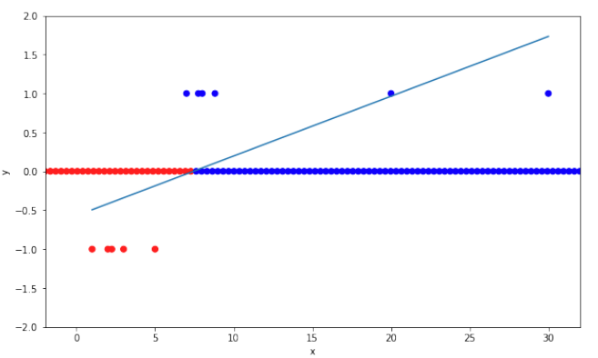

    Exemplos positivos mais a direita contribuem para um erro maior, e exemplos positivos mais à esquerda serão classificados como negativos

### Distribuição *target*

- ***Targets* ruidosos**

  - Exemplos que não são perfeitamente separáveis — a "*target function*" nem sempre é uma função

- Como discutimos, do Teorema de Bayes, sabemos que: $P(y|x)=\frac{P(y)p(x|y)}{p(x)}$

  - Então, em vez de tentar adivinhar $y$, por que não estimar $P(y|x)$?
  - Em vez de $y=f(x)$, nosso alvo será a distribuição $P(y|x)$

- Assumindo que a nossa target é $f(x)=P(y=+1|x)$

  - Podemos escrever $P(y|x) = \cases{f(x), \text{ if } y=+1, \\ 1 - f(x), \text{ if } y=-1}$
  - Note que não temos acesso a $f(x)$, nós só sabemos que $y$ vem de uma distribuição desconhecida $P(y|x)$
  - Mas, se formos capazes de "aprender" $f(x)$, seremos capazes de saber $P(y|x)$

- **Escolhendo um espaço de hipóteses...**

  - Como o nosso *target* é tal que $0 \leq f(x) \leq 1$, vamos considerar hipóteses de mesmo tipo: $h_w(x)= \theta (w^T x)$ 
  - Tal que $\theta$ é a função sigmoide: $\theta(z) = \frac{1}{1+e ^{-z}} = \frac{e^z}{e^z+1}$
    - $0 \leq \theta (z) \leq 1 \implies 0 \leq h_w(x) \leq 1$

  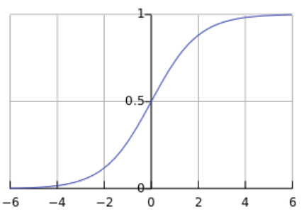

  - Se $h_w(x) \approx f(x)$, então $P(y|x) = \cases{h_w(x), \text{ if } y=+1, \\ 1 - h_w(x), \text{ if } y=-1}$ deve ser um bom estimador de $P(y|x)$
  - Para evitar lidar separadamente com os dois casos, $y=+1$ e $y=-1$, note que $1 - \theta(z) = \theta(-z)$
  - Usando este fato mais $h_w(x)=\theta(w^Tx)$, podemos escrever $P_w(y|x) = \theta(yw^Tx)$

- **Aprendendo a função *target*...**

  - Dados de treinamento disponíveis: $\mathcal{D} = \{ (x^{(n)}, y^{(n)}) \in X \times Y, n= 1, \dots, N\}$
  - Esses exemplos seguem como uma distribuição desconhecida $P(x,y)$
  - $y$ segue a distribuição $P(y|x)$
  - Dentre todas as distribuições $P_w(y|x) = \theta (yw^Tx)$, qual $w$ melhor aproxima $P(y|x)$?

### Função de verossimilhança

- Adivinhar qual é a distribuição que deu origem a essas amostras $\rightarrow$ encontrar a distribuição que maximiza a probabilidade de observar aquelas amostras

- **Estimação de máxima verossimilhança**

  - Assumimos uma distribuição paramétrica e encontramos os parâmetros que correspondem à distribuição que maximiza a probabilidade de observar os exemplos realmente observados

  - Em nossa configuração, dentre todas as distribuições $P_w(y|x) = \theta(yw^Tx)$ (parâmetro $w$), qual é aquele que maximiza a probabilidade de observar os exemplos em $\mathcal{D}$?

  - Assumindo que os exemplos em $\mathcal{D}$ são independentes e identicamente distribuídos, a **função de verossimilhança** pode ser escrita como:
    $$
    \prod_{n=1}^N P_w(y^{(n)}|x^{(n)}) = \prod_{n=1}^N \theta(y^{(n)} w^T x^{(n)})
    $$

- **Problema de otimização**

  - Encontrar $w$ que maximiza $\prod_{n=1}^N \theta(y^{(n)} w^T x^{(n)})$

  - Ou, equivalentemente, que maximiza $\frac{1}{N} \ln (\prod_{n=1}^N \theta(y^{(n)} w^T x^{(n)}))$

  - Ou, equivalentemente, que minimiza:
    $$
    -\frac{1}{N} \ln (\prod_{n=1}^N \theta(y^{(n)} w^T x^{(n)}))  =
    -\frac{1}{N} \sum_{n=1}^N  \ln (\theta(y^{(n)} w^T x^{(n)})) \\ =
    \frac{1}{N} \sum_{n=1}^N  \ln (\frac{1}{\theta(y^{(n)} w^T x^{(n)})}) =
    \frac{1}{N} \sum_{n=1}^N \ln(1+e^{-y^{(n)}w^Tx^{(n)}})
    $$

- **Regressão logística**

  - Função de perda a ser minimizada:
    $$
    E_{in} = \frac{1}{N} \sum^N_{n=1} \underbrace{\ln(1+e^{-y^{(n)}w^Tx^{(n)}})}_{err(y^{(n)}, \hat{y}^{(n)})}
    $$

  - Interpretação:

    - Se os sinais de $y^{(n)}$ e $w^Tx^{(n)}$ concordam, o expoente em $e^{-y^{(n)}w^Tx^{(n)}}$ é negativo $\implies err(y^{(n)}, \hat{y}^{(n)})$ tende a se aproximar de zero
    - Se os sinais de $y^{(n)}$ e $w^Tx^{(n)}$ discordam, o expoente em $e^{-y^{(n)}w^Tx^{(n)}}$ é positivo $\implies err(y^{(n)}, \hat{y}^{(n)})$ tende a ser grande

- **Observações:**

  - $y^{(n)} \in \{ -1, +1 \}$ enquanto $\hat{y}^{(n)} \in [0,1]$
    - Nós usamos $\hat{y}^{(n)}$ para indicar que esta é a saída do algoritmo, mas isso pode não ser o mais adequado já que $\hat{y}^{(n)} = \theta(w^Tx) = P_w (y= +1|x^{(n)})$
    - É por isso que o método é chamado **regressão** logística
  - A formulação que vimos assume $y \in \{ -1, +1 \}$
  - Uma formulação mais comum (?) assume $y \in \{0,1\}$

#### Classificação de erros

- É conveniente que o algoritmo de regressão logística tenha como saída $\hat{y}^{(n)} = \theta(w^Tx) = P_w (y= +1|x^{(n)})$

- **Tipos de classificações de erros:**

  

- Você pode decidir classificar $x^{(n)}$ como positivo somente se $P_w (y= +1|x^{(n)}) \geq 0.8$

  - Por outro lado, $P_w (y= +1|x^{(n)}) \geq 0.3$ pode fazer mais sentido em outros casos
  - O tipo de erro pode ter custos associados

#### Classes desbalanceadas

- Se tivermos muitas observações de uma classe, ela pode desbalancear o modelo
- É importante considerar esse fenômeno no design de classificadores

#### Perda *cross-entropy*

- Formulação quando usamos $Y = \{0,1\}$ em vez de  $Y = \{-1,+1\}$
- Um truque para escrever $P(y|x)$ como uma única equação:

$$
P(y|x) = P(y=1|x)^y P(y=0|x)^{1-y} = P(y=1|x)^y [1 - P(y=1|x)]^{1-y}
$$

- Função de verossimilhança (índice $(n)$ omitido para uma notação mais clara):
  $$
  \begin{align}
  \prod_{(x,y) \in \mathcal{D}} P(y|x) & = \prod_{(x,y) \in \mathcal{D}} P(y=1|x)^y [1 - P(y=1|x)]^{1-y} \\
  & \approx \prod_{(x,y) \in \mathcal{D}}  [\theta(w^Tx)]^y [1 - \theta(w^Tx)]^{1-y} \\
  & = \prod_{(x,y) \in \mathcal{D}} \hat{y}^y (1- \hat{y})^{1-y}
  \end{align}
  $$

- O problema de maximizar a função de verossimilhança acima é equivalente a minimizar a seguinte expressão:
  $$
  \begin{align}
  & -\ln \prod_{(x,y) \in \mathcal{D}} \hat{y}^y (1- \hat{y})^{1-y} = -\sum_{(x,y) \in \mathcal{D}} \ln(\hat{y}^y (1- \hat{y})^{1-y}) \\
  & = -\sum_{(x,y) \in \mathcal{D}} \ln(\hat{y}^y) + \ln((1- \hat{y})^{1-y}) = -\sum_{(x,y) \in \mathcal{D}} y\ln\hat{y} + (1-y)\ln(1- \hat{y})
  \end{align}
  $$

- ***Cross-entropy loss:***

$$
J(w) = -\frac{1}{N} \sum^N_{n=1} y^{(n)} \ln \hat{y}^{(n)} + (1 - y^{(n)}) \ln(1 - \hat{y}^{(n)}), \text{ onde } \hat{y}^{(n)} = \theta(w^Tx)
$$

​		Dadas duas distribuição $p$ e $q$ sobre $A$, *cross-entropy* é definida como: $H(p,q) = - \sum_{a \in A} p(a) \log q(a)$

### Otimização

- Utilizamos o gradiente descendente para otimizar ambas as formulações:

#### Para $Y = \{-1,+1\}:$

​	Fórmula: $E_{in} = \frac{1}{N} \sum^N_{n=1} \ln(1+e^{-y^{(n)}w^Tx^{(n)}})$

​	Gradiente: $\frac{\partial}{\partial w} [\ln(1+e^{-y^{(n)}w^Tx^{(n)}})]= ?$

​	Denote $s=-yx$. Então $\frac{\partial}{\partial w} [\ln(1+e^{w^Ts})]= ?$

​	Como $\frac{\partial}{\partial w} [\ln[f(x)]] = \frac{f'(x)}{f(x)}$, então
$$
\frac{\partial}{\partial w} [\ln(1 + e^{w^T s})]= \frac{(1 + e^{w^T s})'}{1 + e^{w^T s}} = \frac{s e^{w^T s}}{1 + e^{w^T s}} = s \frac{e^{w^T s}}{1 + e^{w^T s}} = s \frac{1}{1 + e^{-w^T s}}
$$
​	Portanto, 
$$
\frac{\partial}{\partial w} [\ln(1 + e^{-y w^T x})] = -\frac{yx}{1 + e^{y w^T x}}
$$

#### Para $Y = \{0,1\}:$

​	Fórmula: $J(w) = -\frac{1}{N} \sum^N_{n=1} y^{(n)} \ln \hat{y}^{(n)} + (1 - y^{(n)}) \ln(1 - \hat{y}^{(n)})$
$$
\hat{y}^{(n)} = h_w(x) = \theta(w^T x) = \frac{1}{1 + e^{-w^Tx}}
$$
​	Derivadas parciais: $\frac{\partial}{\partial w_j} J(w) = \sum^N_{n=1} (\hat{y}^{(n)} - y^{(n)})x_j^{(n)}$

​	Atualização dos pesos: $\Delta w_j(r) =  \sum^N_{n=1} (y^{(n)} - \hat{y}^{(n)})x_j^{(i)}$

### Um terceiro modelo linear

$$
s = \sum^d_{i=0} w_i x_i
$$

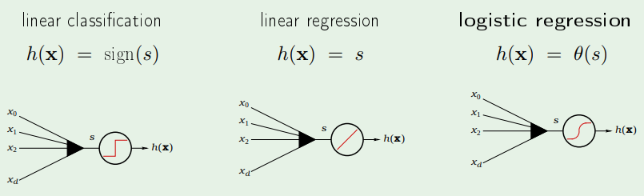

## Is learning feasible?

- Como a hipótese escolhida $g$ vai se comportar fora do conjunto de treinamento (no mundo real)?
  - Aprender X Memorizar
- **Fato**: a função $f$ é deseconhecida
- Não há garantia de que escolheremos o $g$ correto para $f$
- Conseguimos escolher uma hipótese $g$ que tem um erro pequeno?
- Nosso objetivo é escolher o $g \in \mathcal{H}$ ótimo, com mínimo $E_{out}(g)= \mathbb{E} [Err(y, g(x))]$ (Erro esperado $p(x,y)$)
- Escolhemos $g$ baseado em $E_{out} = $
- **ERROS**
  - Erro empírico $E_{in}$ (estávamos chamando de $J$)
  - Erro verdadeiro $E_{out}$
- **QUESTÃO:** $E_{in}(g)$ diz algo sobre $E_{out}(g)$?

### Uma visão probabilística

#### Problema: urna com bolas de gude verdes e vermelhas

- $\mu = $ probabilidade de bolinhas vermelhas ($E_{out}$)
- Dada uma amostra de $N$ bolinhas (escolhidas independentemente), temos $\nu =$ fração de bolinhas vermelhas ($E_{in}$)
- $\mathbb{P} [\text{escolher uma bolinha vermelha}] = \mu$
- $\mathbb{P} [\text{escolher uma bolinha vermde}] = 1-\mu$
- $\nu$ diz algo sobre $\mu$?
  - Não! A amostra pode ser majoritariamente verde enquanto a urna é majoritariamente vermelha
  - Sim! A frequência da amostra $\nu$ é provavelmente próxima à frequência da urna $\mu$
- Possível X provável
- $\nu$ é uma estimativa de $\mu$: é boa o suficiente? $|\nu-\mu|$ é pequeno?
- **Teorema do Limite Central**
  - Tome amostras de tamanho $N$ e compute a fração de bolinhas vermelhas $\nu$
  - Repita várias vezes
  - A distribuição de $\nu$ será uma ditribuição normal com média $\mu$
  - Quanto maior o $N$, menor o desvio padrão de $\nu$

- Outras "leis" que estabelecem uma relação entre $\nu$ e $\mu$:

  - **Desigualdade de Hoeffding**

    $P(|\nu - \mu|> \epsilon) \leq 2e^{-2 \epsilon^2 N}$

    - Limita a probabilidade de ter uma estimativa ruim, relacionada ao tamanho da amostra $(N)$

    - Bound variation em função de $N$:

      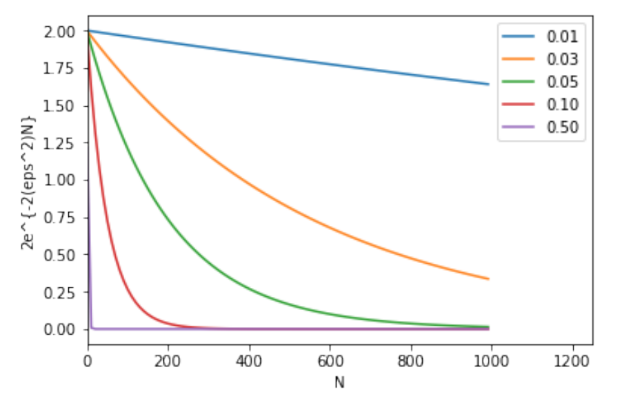

- Conceitualmente, podemos colorir cada $x \in \mathcal{X}$:
  - verde se $h(x) = f(x)$
  - vermelho se $h(x) \neq f(x)$
- $E_{out}(h)$é a fração de instâncias vermelhas em $\mathcal{X}$
- $E_{in}(h) $ é a fração de instâncias vermelhas em $\mathcal{D}$

- $E_{out}(h)$ = parâmetro desconhecido
- $E_{in}(h) $ = estimativa de $E_{out}(h)$
- $|E_{in}(h) - E_{out}(h)| > \epsilon $??

#### Dada uma hipótese $h$ qualquer...

- Generalizando, temos:

  $\mathbb{P}(|E_{in}(h) - E_{out}(h)|> \epsilon) \leq 2e^{-2 \epsilon^2 N}$

- **Problema**: a fórmula só funciona para um certo $h$ fixo

  - Essa é uma "verificação" de $h$, não learning
  - Em geral fazemos uma escolha de $h$

- Múltiplas urnas: $h_1, h_2, \dots, h_M$
  - $E_{in}(h_1), E_{in}(h_2), \dots, E_{in}(h_M)$
  - $E_{out}(h_1), E_{out}(h_2), \dots, E_{out}(h_M)$
- Não podemos simplesmente aplicar Hoeffding à hipótese escolhida $g$, porque $g$ não é uma hipótese fixada, é escolhida

#### Hoeffding no contexto de ML

- Devemos considerar a probabilidade de algumas hipóteses $h_m$ ser tal que $|E_{in}(h_m) - E_{out}(h_m)|> \epsilon$

- Se tivermos $M$ hipóteses $h_1, h_2, \dots, h_M$ e escolhermos uma, que nós denotamos como $g$,
  $$
  \begin{align}
  \mathbb{P}[|E_{in}(g) - E_{out}(g)|> \epsilon] & \leq \mathbb{P}[|E_{in}(h_1) - E_{out}(h_1)|> \epsilon \text{ or }  |E_{in}(h_2) - E_{out}(h_2)|> \epsilon \text{ or } \dots \text{ or } |E_{in}(h_M) - E_{out}(h_M)|> \epsilon]  \\
  & \leq \sum^M_{m=1} \mathbb{P}[|E_{in}(h_m) - E_{out}(h_m)|> \epsilon] \\
  & \leq 2Me^{-2 \epsilon^2 N}
  \end{align}
  $$

- Portanto, temos:
  $$
  P(|E_{in}(g) - E_{out}(g)|> \epsilon) \leq 2Me^{-2 \epsilon^2N}
  $$

- **Consistente** com a nossa intuição:

  - exponencial negativo $\rightarrow$ quanto maior o $N$, menor o bound

- **Contrário** a nossa intuição:

  - o tamanho do conjunto de hipóteses $M$ $\rightarrow$ quando maior o espaço de hipóteses $\mathcal{H}$, maior o bound
  - questão: então deveríamos escolher um espaço de hipóteses pequeno?
  
- As boas notícias: podemos fazer o limite de Hoeffding ser arbitrariamente pequeno (**cenário de verificação**)

- Se $M$ é inifinito, o limite será grande ­— sem significado (**cenário de aprendizado**)

  - Podemos trocar o $M$ por um valor **finito**?

#### Podemos melhorar $M$?

- $M$ veio de várias uniões de probabilidade

- Porém eventos ruins têm muitos overlaps

  - $\Delta E_{out}$: mudança nas áreas $+1$ e $-1$
  - $\Delta E_{in}$: mudança nas labels dos pontos dados

- $|E_{in}(h_1) - E_{out}(h_1)| \approx |E_{in}(h_2) - E_{out}(h_2)|$

- **A escolha de $g$ a partir de $\mathcal{H}$ é afetada por $D$ (dados de treinamento)**

  - Geralmente, há muitas hipóteses $h_j$ similares que classificam as amostras $D$ da mesma maneira

  - a

- Para melhorar o limite, vamos substituiur o *union bound* com um que leva em consideração overlaps

- Para isso, vamos **definir um "número"** que caracteriza a complexidade de $\mathcal{H}$

  - **Conceitos importantes:**
    - Dicotomia
    - Função de crescimento
    - Break point

### Dicotomia

- Em vez de considerar o espaço de entrada inteiro, consideramos um conjunto finito de pontos, e contamos o número de **dicotomias**

Seja $X = \{ x_1, x_2, \dots, x_N \}$ ($N$ pontos)

Seja $\mathcal{H}$ um espaço de hipóteses

**Uma dicotomia gerada por $\mathcal{H}$:** qualquer bipartição de $X$ como $X_{-1} \cup X_{+1}$ que obedece uma determinada hipótese $h \in \mathcal{H}$:
$$
\mathcal{H}(x_1, x_2, \dots, x_N) = \{ (h(x_1), h(x_2), \dots, h(x_N))\ |\ h \in \mathcal{H} \}
$$

#### Mini-hipóteses

- Uma hipótese: $h : \mathcal{X} \rightarrow \{ -1, +1\}$
- Uma dicotomia $h : \{x_1, x_2, \dots, x_N \} \rightarrow \{ -1, +1\}$
- Número de hipóteses $|\mathcal{H}|$ pode ser infinito
- Número de dicotomias $| \{x_1, x_2, \dots, x_N \} |$ é no máximo $2^N$
- Candidato para

**Por que o número de dicotomias $\mathcal{H}(x_1, x_2, \dots, x_N)$ é no máximo $2^N$?**

- Se você considerar outro conjunto de pontos, como $X' = \{x'_1, x'_2, \dots, x'_N \}$
  1. $\mathcal{H}(x_1, x_2, \dots, x_N) = \mathcal{H}(x'_1, x'_2, \dots, x'_N)$?
  2. $| \mathcal{H}(x_1, x_2, \dots, x_N) | = | \mathcal{H}(x'_1, x'_2, \dots, x'_N) |$?

### Função de crescimento (growth function)

A função de crescimento conta o **máximo** de dicotomias em quaisquer $N$ pontos
$$
m_{\mathcal{H}}(N) = \max_{x_1, \dots, x_n \in \mathcal{X}} |\mathcal{H} (x_1, \dots, x_N|
$$
A função de crescimento satisfaz: $m_{\mathcal{H}}(N) \leq 2^N$

1. **Exemplo:** para o perceptron

   - $m_{\mathcal{H}}(3) = 8$

   - $m_{\mathcal{H}}(4) = 14$ (o problema do *xor*)
   - $m_{\mathcal{H}}(N) = ?$

2. **Exemplo:** positive rays

   - $\mathcal{H}$ é um conjunto de $h: \mathbb{R} \rightarrow \{-1,+1\}$

   - $h(x)= sign(x-a)$
   - **$m_{\mathcal{H}}(N) = n+1$ (linear)**

3. **Exemplo:** positive intervals

   -  $\mathcal{H}$ é um conjunto de $h: \mathbb{R} \rightarrow \{-1,+1\}$

   - Coloque as extremidades em dois dos $N+1$ pontos

   - **$m_{\mathcal{H}}(N) = {N+1 \choose 2} + 1 = \frac{1}{2}N^2 + \frac{1}{2}N + 1$ (quadrático)**

4. **Exemplo:** conjuntos convexos

   -  $\mathcal{H}$ é um conjunto de $h: \mathbb{R}^2 \rightarrow \{-1,+1\}$
   - $h(x) = +1$ é convexo
   - **$m_{\mathcal{H}}(N) = 2^N$ (exponencial)**
   - Os $N$ pontos são "fragmentados" pelos conjuntos convexos

#### De volta à big picture...

Tínhamos a seguinte desigualdade: $\mathbb{P}(|E_{in}(g) - E_{out}(g)|> \epsilon) \leq 2Me^{-2 \epsilon^2N}$

- O que acontece se $m_{\mathcal{H}}$ substituir $M$? (O que ela diz sobre a expressividade do conjunto de hipóteses?)
- $m_{\mathcal{H}}(N)$ polinomial $\implies$ BOM!
- Basta provar que $m_{\mathcal{H}}(N)$ é polinomial? (Sem calcular explicitamente!)
  - Se a função de crescimento for polinomial, o limite pode ser arbitrariamente pequeno!

### Break point

Se nenhum conjunto de dados $D$ de tamanho $k$ pode ser fragmentado por $\mathcal{H}$ ($\mathcal{H}$ consegue gerar todas as dicotomias sobre os $N$ pontos), então $k$ é um **break point** para $\mathcal{H}$
$$
m_{\mathcal{H}}(k) < 2^k
$$

1. Para perceptrons 2D, $k=4$ ­— não conseguimos gerar todas as dicotomias sobre esse conjuntos de dados
2. Para o positive rays, break point $k=2$
3. Para o positive intervals, break point $k=3$
4. Para o convex sets, break point $k = \infty$

- Se o *break-point* for finito, então a função de crescimento é polinomial

### Provando que $m_{\mathcal{H}}(N)$ é polinomial

- Para provar que $m_{\mathcal{H}}(N)$ é polinomial, vamos mostrar que $m_{\mathcal{H}}(N) \leq \dots \leq \dots \leq$ um polinômio

- **Quantidade chave:** $B(N, k)$: número máximo de dicotomias de $N$ pontos, com *break-point* $k$

  -  Computar $B(N, k)$ é muito custoso, vamos limitar $B(N, k)$!

  - **Limite recursivo em $B(N, k)$**

    - Considere $B(N, k) = \alpha + 2 \beta$

      

      ($S_1$ não há repetições até $x_{N-1}$. $S_2$ há repetições até  $x_{N-1}$, sendo que $S_2^+$ tem $x_N$ positivo e $S_2^-$ tem $x_N$ negativo)

    - **Estimando $\alpha$ e $\beta$**:

      Focando nas $x_1, x_2, \dots, x_{N-1}$ colunas: 

      $\alpha + \beta \leq B(N-1, k)$ (isso ocorre porque $\alpha + \beta$ são linhas de dicotomias sobre $N-1$ pontos)

    - **Estimando $\beta$**:

      Agora, focando nas linhas $S_2 = S_2^+ \cup S_2^-$:

      $\beta \leq B(N-1, k-1)$ (isso ocorre porque $\beta$ não pode ser break-point $k$, afinal ele tem apenas $N-1$ pontos)

    - **Portanto...**

      $B(N, k) \leq B(N-1, k) + B(N-1, k-1)$ 

  - **Solução analítica para o limite de $B(N,k)$**

    **Teorema:** 
    $$
    B(N, k) \leq \sum^{k-1}_{i=0} {N \choose i} \\
    \sum^{k-1}_{i=0} {N \choose i} = \sum^{k-1}_{i=0} {N-1 \choose i} + \sum^{k-2}_{i=0} {N-1 \choose i}
    $$
    (Prova por indução omitida)

- **É POLINOMIAL!**

  Para um dado $\mathcal{H}$, o break-point $k$ é fixado
  $$
  m_{\mathcal{H}}(N) \leq \underbrace{\sum^{k-1}_{i=0} {N \choose i}}_{\text{máxima potência é }N^{k-1}}
  $$

- 3 exemplos:

  1. *positive rays* ($k = 2$)
     $$
     \begin{align}
     m_{\mathcal{H}}(N) = n + 1 \leq n + 1
     \end{align}
     $$
     
  2. *positive intervals* ($k = 3$)
     $$
     m_{\mathcal{H}}(N) = \frac{1}{2}N^2 + \frac{1}{2}N + 1 \leq \frac{1}{2}N^2 + \frac{1}{2}N + 1
     $$
     
  3. 2D perceptron ($k=4$)
     $$
     m_{\mathcal{H}} (N) = ? \leq \frac{1}{6}N^3 + \frac{5}{6}N + 1
     $$
  
- **Quando há *break-point* $k$, o número efetivo de hipóteses é limitado por um polinômio de ordem $N^{k-1}$**

### Provando que $m_{\mathcal{H}}(N)$ pode substituir $M$

- Em vez de $P(|E_{in}(g) - E_{out}(g)|> \epsilon) \leq 2Me^{-2 \epsilon^2N}$, queremos $P(|E_{in}(g) - E_{out}(g)|> \epsilon) \leq 2 m_{\mathcal{H}}(N) e^{-2 \epsilon^2N}$

#### Como $m_{\mathcal{H}}(N)$ se relaciona com *overlaps*?

- Espaço de todos os possíveis *datasets* de tamanho $N$
  - Dada uma hipótese $h$, é possível computar $E_{in}(h)$ à respeito de cada *dataset*
  - De acordo com Hoeffding, a probabilidade de ocorrer um evento "errado" (EX: $|E_{in}(h) - E_{out}(h)| > \epsilon $) acontecer é limitada
  - Quando temos múltiplas hipóteses (UNION BOUND), devemos considerar a probabilidade de eventos "ruins" acontecerem associados a todos eles
  - Como estamos considerando o *Union Bound*, *overlaps* não entram para a conta (então existem MUITOS eventos "ruins")
  - Mas sabemos por Hoeffding que um *dataset* corresponde a múltiplos eventos "ruins"
  - Pelas dicotomias, sabemos que o limite é muito maior do que Hoeffding propôs (há uma família de hipóteses)

- A função de crescimento "agrupa hipóteses" de acordo com  seu comportamento em $D$
- Isto estabelece a ligação entre *overlaps* e dicotomias

#### O que fazer com $E_{out}$?

- O evento $|E_{in}(h) - E_{out}(h)| > \epsilon $ depende não apenas de $D$, mas também do espaço $\mathcal{X}$ inteiro
  - Como estamos "agrupando" hipóteses baseadas no comportamento de $D$,
- Usar, além de $D$, um $D'$
  - Queremos estimar $|E_{in}(h) - E_{out}(h)| \approx |E_{in}(h) - E'_{in}(h)|$

#### Desigualdade Vapnik–Chervonenkis (VC)

Após muitas manipulações matemáticas, chegamos em:
$$
P(|E_{in}(g) - E_{out}(g)|> \epsilon) \leq 4 m_{\mathcal{H}}(2N) e^{-\frac{1}{8} \epsilon^2N}
$$

- Explicação da constante $2$ (multiplicando $N$):
  - hipóteses são agrupadas no seu comportamento em $D$, mas seu comportamento fora de $D$ não é o mesmo
  - Para rastrear $|E_{in}(h) - E_{out}(h)| > \epsilon $, rastreamos $|E_{in}(h) - E'_{in}(h)| > \epsilon $ (relativo a $D$ e $D'$, ambos de tamanho $N$)
- Explicação das constantes $4$ e $\frac{1}{8}$:
  - São fatores para levar em consideração as incertezas adicionadas quando substituímos $|E_{in}(h) - E_{out}(h)| > \epsilon $ por $|E_{in}(h) - E'_{in}(h)| > \epsilon $ 

### Dimensão VC

- A dimensão VC $d_{VC}(\mathcal{H})$ é o maior número de pontos que podem ser fragmentados por $\mathcal{H}$ (O maior valor de $N$ para o qual $m_{\mathcal{H}}(N) = 2^N$)
- Se $k$ é um break point para $\mathcal{H}$, então $d_{VC}(\mathcal{H}) < k$
- $d_{VC}(\mathcal{H}) +1$ é break point para $\mathcal{H}$

**Exemplos**:

- $\mathcal{H}$ é **positive rays** $\implies$ $d_{VC}(\mathcal{H}) = 1$
- $\mathcal{H}$ é **positive intervals** $\implies$ $d_{VC}(\mathcal{H}) = 3$
- $\mathcal{H}$ é **convex set**  $\implies$ $d_{VC}(\mathcal{H}) = \infty$

- Seja $d$ a dimensão dos dados de entrada $x = (x_1, x_2, \dots, x_n)$

#### Para perceptrons, $d_{VC} = d+1$

Para provar isso, é suficiente provar que:

- $d_{VC} \geq d+1$

- $d_{VC} \leq d+1$

- Provando que $d_{VC} \geq d+1$:

  ​	Precisamos mostrar que existe um conjunto de $d+1$ pontos que podem ser fragmentados pelo perceptron

  ​	Vamos escolher cuidadosamente (por construção) $d+1$ pontos, atribuir rótulos arbitrários em $\{ -1, +1 \}$ para cada um deles, e então mostrar que há uma hipótese que coincide com os rótulos

  ​	Um conjunto de $N=d+1$ pontos em $\mathbb{R}^d$ fragmentados pelo perceptron:
  $$
  X =
  \begin{bmatrix} — x_1^T — \\ — x_2^T —  \\ \vdots \\ — x_{d+1}^T —  \end{bmatrix}
  =
  \begin{bmatrix}
  1 & 0 & 0 & \dots & 0 \\
  1 & 1 & 0 & \dots & 0 \\
   & \vdots & & \ddots & 0 \\
  1 & 0 & \dots & \dots & 1 \\
  \end{bmatrix}
  $$
  ​	$X$ é inversível.

  ​	Para qualquer $y = \begin{bmatrix} y_1 \\ y_2 \\ \vdots \\ y_{d+1} \end{bmatrix} = \begin{bmatrix} \pm 1 \\ \pm 1 \\ \vdots \\ \pm 1 \end{bmatrix}$,podemos encontrar um vetor $w$ satisfazendo $sign(Xw)=y$. Basta tomar $Xw = y$, que significa que $w = X^{-1}y$

- Provando que $d_{VC} \leq d+1$:

  Precisamos mostrar que nenhum conjunto com $d+2$ pontos pode ser fragmentado pelo perceptron

  Vamos escolher qualquer conjunto de $d+2$ pontos e mostrar que sempre é possível construir uma dicotomia que não pode ser gerada por nenhuma das hipóteses

  Para quaisquer $d+2$ pontos $x_1, \dots, x_{d+1}, x_{d+2}$: temos mais pontos do que dimensões, então temos: $x_j = \sum_{i \neq j} a_i x_i$ (é possível escrever como combinação linear dos demais)

  Então, considere a seguinte dicotomia:

  ​	$x_i$s com $a_i$ não nulo, tome $y_i = sign(a_i)$ e $x_j$ toma $y_j = -1$ 

  ​	Nenhum perceptron consegue implementar tal dicotomia!

  Portanto, 
  $$
  x_j = \sum_{i \leq j} a_i x_i \implies w^Tx_j = \sum_{i \leq j} a_i w^T x_i
  $$
  ​	Se $y_i = sign(w^Tx_i) = sign(a_i)$, então $a_i w^T x_i > 0$

  ​	Isso força $w^T x_j = \sum_{i \neq j} a_i w^T x_i > 0$

  ​	Portanto, $y_j = sign(w^Tx_j) = +1$

- Note que o $d+1$ no perceptron é o número de parâmetros $w_0, w_1, \dots, w_n$

#### A função de crescimento

- Em termos da dimensão VC $d_{VC}$:

$$
m_{\mathcal{H}}(N) \leq \underbrace{\sum^{d_{VC}}_{i=0} {N \choose i}}_{\text{potência máxima é } N^{d_{VC}}}
$$

- É fácil de mostrar por indução que:

  
  $$
  m_{\mathcal{H}}(N) \leq \sum^{d_{VC}}_{i=0} {N \choose i}\leq N^{d_{VC}}+1
  $$

- Portanto
  $$
  m_{\mathcal{H}}(2N) \leq (2N)^{d_{VC}}+1
  $$

#### Limite VC

- Temos

$$
P(|E_{in}(g) - E_{out}(g)|> \epsilon) \leq 4 m_{\mathcal{H}}(2N) e^{-\frac{1}{8} \epsilon^2N}
$$

- Então vamos rearranjar:
  $$
  \delta = 4 m_{\mathcal{H}}(2N) e^{-\frac{1}{8} \epsilon^2 N} \implies \epsilon = \sqrt{\frac{8}{N} \ln \frac{4 m_{\mathcal{H}}(2N)}{\delta}}
  $$
  
- Se $P(|a-b| > \epsilon) \leq \delta$, então com probabilidade $1-\delta$ temos $|a-b| \leq \epsilon$, isto é $b - a \leq \epsilon \leq a-b$

- Tomando $a = E_{in}$ e $b=E_{out}$, com probabilidade $1-\delta$ temos:

$$
E_{out} \leq E_{in} + \sqrt{\frac{8}{N} \ln \frac{4 m_{\mathcal{H}}(2N)}{\delta}}
$$

#### Observações

- Erro de generalização

  - Neste curso, faremos referência ao $|E_{in}(h) - E_{out}(h)$
  - Na literatura, costuma ser $E_{out}(h)$

- Generalização do limite VC

  - Com probabilidade $\geq 1 - \delta$:

  $$
  \Omega = \sqrt{\frac{8}{N} \ln \frac{4 m_{\mathcal{H}}(2N)}{\delta}} \\
  E_{out} \leq E_{in} + \Omega
  $$

- Proporções:

  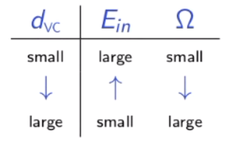

  - Gostaríamos de diminuir tanto o $E_{in}$ quanto o $\Omega$ baixos! $\implies$ vamos ter que encontrar um balanço

#### Dimensão VC e aprendizado

- $d_{VC}(\mathcal{H})$ é finito $\implies g \in \mathcal{H}$ vai generalizar
- Independente do algoritmo de aprendizado
- Independente da distribuição da entrada
- Independente da função *target*

#### Significado intuitivo da dimensão VC

1. **Graus de liberdade**
   - Parâmetros criam graus de liberdade: 
     - número de parâmetros: análogo a graus de liberdade
     - $d_{VC}$: equivalente "binário" dos graus de liberdade
   - CUIDADO: não é **diretamente** relacionado ao número de parâmetros
     - Alguns parâmetros podem não contribuir com graus de liberdade
     - $d_{VC}$ mede o número de parâmetros EFETIVO

#### Complexidade da amostra

- Se $d_{VC}$ é finito, o aprendizado é generalizado

  - Mas de quantas amostras vamos precisar?

- Vamos examinar o comportamento de uma aproximação grosseira para o limite:
  $$
  P(|E_{in}(g) - E_{out}(g)|> \epsilon) \leq 4 m_{\mathcal{H}}(2N) e^{-\frac{1}{8} \epsilon^2N}
  $$

  - Aproximação: $N^{d_{VC}} e^{-N}$ 

  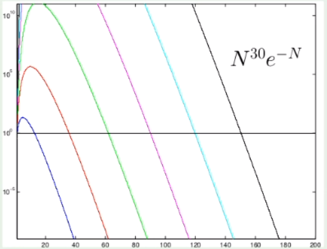

  - Fixe $N^d e^{-N} = $ valor pequeno
  - Como $N$ muda com $d$?
  - Regra do dedão: $N \geq 10 d_{VC}$ 

---

### Bias-variance trade-off

- Com a dimensão VC, tínhamos:

$$
E_{out}(g) \leq E_{in}(g) + \Omega(N, \mathcal{H}, \delta)
$$

- ***Fitting*/aproximação**: quando maior $\mathcal{H}$, melhor a aproximação
- **Generalização**: quanto maior o $\mathcal{H}$, pior é a generalização

#### A ideia do modelo

- Outro modelo que tem a estrutura de *trade-off* entre aproximação e generalização
- Bias se refere a hipótese média $\bar{g}$
- Vamos definir $E_{out} = \text{bias} + \text{variância}$

- Análise para o problema de regressão usando o erro quadrático médio

#### Desenvolvendo o bias

Começando com $E_{out}$:
$$
\begin{align}
& E_{out}(g^{(\mathcal{D})}) = \mathbb{E}_x[(g^{(\mathcal{D})}(x) - f(x))^2] \\
& \mathbb{E}_{\mathcal{D}}[E_{out}(g^{(\mathcal{D})})] = \mathbb{E}_{\mathcal{D}}[\mathbb{E}_{x}[(g^{(\mathcal{D})}(x) - f(x))^2]] \\
& = \mathbb{E}_{x}[ \mathbb{E}_{\mathcal{D}}[(g^{(\mathcal{D})}(x) - f(x))^2]]
\end{align}
$$
Agora, vamos focar em:
$$
\mathbb{E}_{\mathcal{D}}[(g^{(\mathcal{D})}(x) - f(x))^2]
$$

- **A hipótese média**

  Para avaliar $\mathbb{E}_{\mathcal{D}}[(g^{(\mathcal{D})}(x) - f(x))^2]$, vamos definir a **hipótese média $\bar{g}(x)$**:

$$
\bar{g}(x) = \mathbb{E}_{\mathcal{D}}[g^{(\mathcal{D})}(x)]
$$

​	Imagine **muitos** *datasets* $\mathcal{D}_1, \mathcal{D}_2, \dots, \mathcal{D}_K$
$$
\bar{g}(x) \approx \frac{1}{K} \sum^K_{k=1} g^{(\mathcal{D_k})}(x)
$$

- Usando $\bar{g}(x)$:
  $$
  \begin{align}
  & \mathbb{E}_{\mathcal{D}}[(g^{(\mathcal{D})}(x) - f(x))^2] = \mathbb{E}_{\mathcal{D}}[(g^{(\mathcal{D})}(x) - \bar{g}(x) + \bar{g}(x) - f(x))^2] \\
  &  = \mathbb{E}_{\mathcal{D}}[(g^{(\mathcal{D})}(x) - \bar{g}(x))^2 + (\bar{g}(x) - f(x))^2 + 2(g^{(\mathcal{D})}(x) - \bar{g}(x))(\bar{g}(x) - f(x)) ] \\
  & = \mathbb{E}_{\mathcal{D}}[(g^{(\mathcal{D})}(x) - \bar{g}(x))^2] + (\bar{g}(x) - f(x))^2
  \end{align}
  $$

- Então temos
  $$
  \mathbb{E}_{\mathcal{D}}[(g^{(\mathcal{D})}(x) - f(x))^2] = \underbrace{\mathbb{E}_{\mathcal{D}}[(g^{(\mathcal{D})}(x)}_{var(x)} - \underbrace{\bar{g}(x))^2] + (\bar{g}(x) - f(x))^2}_{bias(x)}
  $$
  (O **bias** diz respeito à discrepância em relação ao valor médio e ao melhor que você pode fazer. A **variância** é de fato a variância do bias. Ambos em relação a cada um dos $x$.)

  Portanto:
  $$
  \begin{align}
  & \mathbb{E}_{\mathcal{D}}[E_{out}(g^{(\mathcal{D})})] = \mathbb{E}_x [\mathbb{E}_{\mathcal{D}}[(g^{(\mathcal{D})}(x) - f(x))^2]] \\
  & = \mathbb{E}_x[bias(x) + var(x)] \\
  & = bias + var
  \end{align}
  $$

#### O trade-off

- $bias = \mathbb{E}_x[ (\bar{g}(x) - f(x))^2]$
- $var = \mathbb{E}_x [\mathbb{E}_{\mathcal{D}}[(g^{(\mathcal{D})}(x) - \bar{g}(x))^2]]$

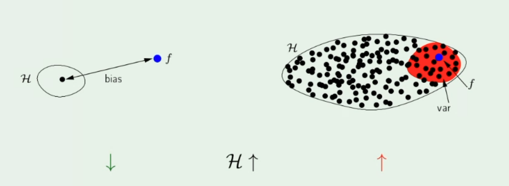

#### Comparando com a dimensão VC

- **Análise VC:** $E_{in}$ é computado com respeito a um *dataset* $D$

- **Análise bias-variance:** bias se refere a uma a uma hipótese média $\bar{g}$, com respeito a todos os *datasets* $D$ de tamanho fixo
  - Portanto não pode ser calculado explicitamente

---

### Curvas de aprendizado

Seja $\mathcal{D}$ um conjunto de dados de tamanho $N$, queremos estimar o melhor erro esperado possível, o erro empírico $E_{in}$ e o erro verdadeiro $E_{out}$.

**As curvas:**

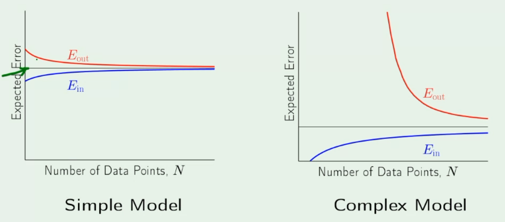

- A linha cinza é o melhor que podemos fazer, e não depende do tamanho da amostra
- Quanto maior o tamanho da amostra, maior o $E_{in}$
- Quanto maior o tamanho da amostra, menor o $E_{out}$

**Como as curvas determinam as análises VC e *bias-variance*:**

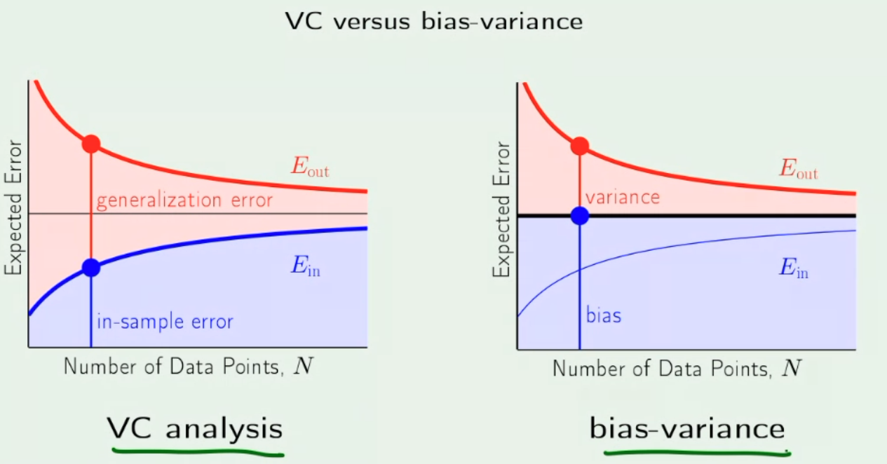

- As análises VC e *bias-variance* decompõem $E_{out}$ em dois termos

- Eles podem ser interpretados de acordo com o ***trade-off* aproximação-generalização**
  $$
  \begin{matrix}
  & & \text{aproximação} & & \text{generalização} \\
  & & \downarrow & & \downarrow \\
  E_{out} & \leq & E_{in} & + & \Omega \\
  E_{in} & = & bias & + & var
  \end{matrix}
  $$

- A expressividade de $\mathcal{H}$ deve ser combinada à quantidade de dados disponíveis

---

### Linear X non-linear

- Examinando o espaço de hipóteses

- Até agora vimos apenas funções lineares em nossos métodos

- Funções não lineares: polinômios
- Qualquer funçao $s: \mathbb{R}^d \rightarrow \mathbb{R} $ pode ser usada para classificação:
  - $s<0 \implies$ classe := negativa
  - $s>0 \implies$ classe := positivo
  - $s=0 \implies$ fronteira de decisão
- Dizer que um espaço de hipóteses de um algoritmo é linear implica em **linearidade de pesos**
  - Por exemplo, note que $f_2(x_1, x_2) = w_0 + w_1x^2_1 + w_2x_1x_2$ é **não-linear** com respeito a $x_i$, mas é **linear** com respeito a $w_i$

#### Transforme os dados não linearmente

$(x_1, x_2) \rightarrow \Phi \rightarrow (x^2_1, x^2_2)$

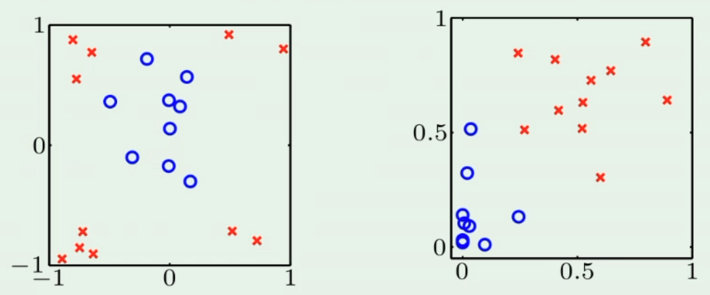

**Mais formalmente...**
$$
x = (x_0, x_1, \dots, x_d) \rightarrow \Phi \rightarrow \ z = (z_0, z_1, \dots, z_\tilde{d})
$$
(A ideia é aumentar a dimensão!)

Cada  $z_i=\Phi(x)$, $z = \Phi(x)$.

Exemplo: $z = (1, x_1, x_2, x_1x_2, x_1^2, x_2^2)$

Hipótese final $g(x)$ no espaço $\mathcal{X}$: $sign(\tilde{w}^T \Phi (x))$ ou $\tilde{w}^T \Phi (x)$

#### O preço que pagamos:

$$
\begin{matrix}
x = (x_0, x_1, \dots, x_d) & \rightarrow \Phi \rightarrow \ & z = (z_0, z_1, \dots, z_\tilde{d}) \\
\downarrow & & \downarrow \\
w & & \tilde{w} \\
d_{VC} = d + 1 & & d_{VC} \leq \tilde{d} + 1
\end{matrix}
$$

#### Conclusão

- Modelos lineares são simples, mas têm habilidades limitadas para discriminar classes
- Existem muitos algoritmos não lineares, como redes neurais, árvores de decisão, etc
- Transformação não-linear aplicada aos dados
  - Um tipo de transformação de features
  - Alguns algoritmos, como SVM, explicitamente exploram esse fato
  - Camadas de redes neurais podem ser interpretadas como entradas de transformadores de features

---

### Multiclass classification

Problema com $C$ classes

**Abordagem 1:** Combinar múltiplos classificadores binários

- **OVA:** One versus All
- **OVO:** One versus One

#### OVA

- um classificador para cada classe: $h_j$ é um classificador binário desginado a reconhecer objetos da classe j entre todos os objetos
- um total de C classificadores binários: hj, j = 1, 2, \dots, C
- assumir que cada classificador devolve um *score* entre [0,1] (exemplo: regressão logística)
- **Decisão**: dado $x$, tome $\hat{y} = \arg\max_j \{ h_j(x) \}$

#### OVO

- um classificador para cada par de classes =: $h_{jk}$ é um classificador binário treinado usando apenas exemplos da classe $j$ (positiva) e $k$ (negativa)
- total de $\frac{C(C-1)}{2}$ classificadores binários: $h_{jk}, j <k, j, k = 1, 2, \dots, C$ (note que para $k>j$, temos $h_{kj} = 1 - h_{jk}$)

- assumir que cada classificador devolve um *score* entre [0,1]
- **Decisão**: dado $x$, tome $\hat{y} = \arg\max_{j \in \{ 1, 2, \dots, C \}} \{ \sum^C_{k=1} h_{jk}(x) \}$

#### Hard X soft classifiers

- Note que OVO e OVA podem ser baseados em qualquer tipo de classificador binário

  - Se o classificador devolve um valor de score (ou seja, uma estimativa de $P(y|x)$), então as regras dadas anteriormente podem ser utilizadas

- E se utilizássemos **classificadores hard** em vez de **classificadores soft**?

  - **Classificador hard:** saída em $\{ 0, 1 \}$ (rótulo de classe $y$)
  - **Classificador soft:** saída em $[0,1]$ (probabilidade condicional $P(y|x)$)

- Podemos usar, por exemplo, o **voto da maioria**

  - Voto pode lgerar **regioẽs com classificação indefinida**

    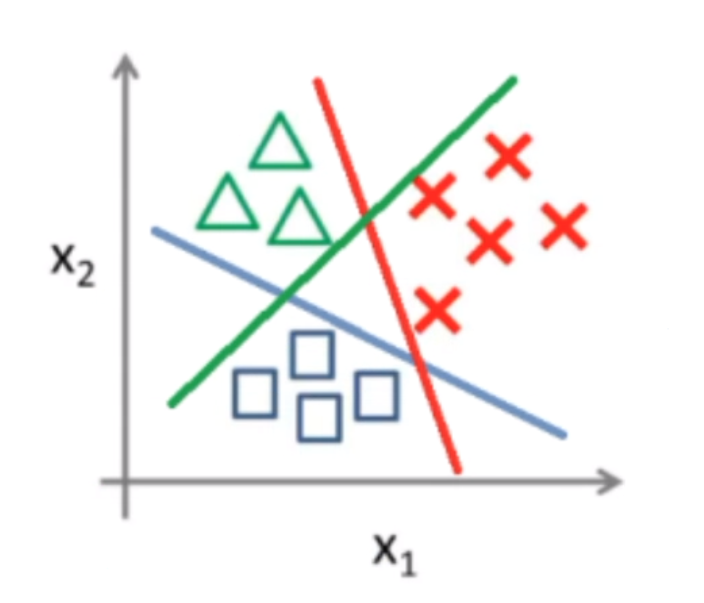

  - A região triangular no centro não receberá nenhuma classificação

#### Emsemble of classifiers

- A ideia de combinar classificadores

### Softmax

**Abordagem 2:** Algoritmos inerentemente multiclasses

#### Regressão logística multinomial

- A generalização da regressão logística para múltiplcas classes
- Para estimar s probabilidades condicionais utilizamos a **função softmax**:

$$
\hat{p}_j = \hat{P}(y=j|x) = \frac{e^{w_j^Tx}}{\sum^C_{i=1} e^{w_i^Tx}}, j=1, 2, \dots, C
$$

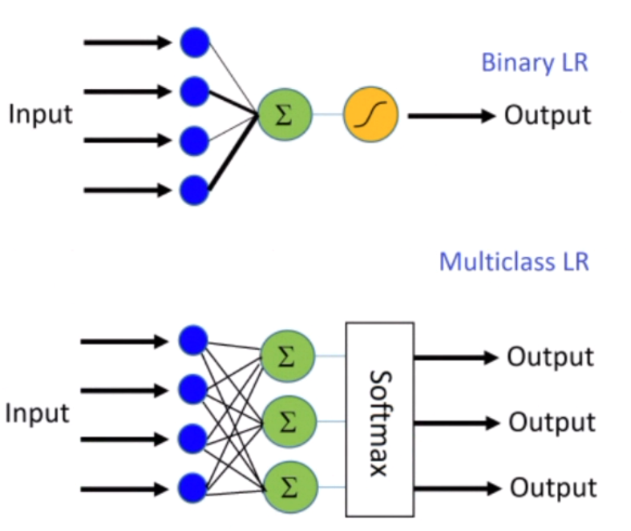

#### Função de custo para o caso multiclasse

- **One-hot enconding** da saída:

  Para cada entrada $x^{(i)}$, a saída é um vetor $y^{(i)} = (y_1^{(i)}, y_2^{(i)}, \dots, y_C^{(i)})$ com $y_j^{(i)}= 1 \iff x^{(i)}$ é da classe $j, j = 1, 2, \dots, C$

- **Cross-entropy loss** (entradas wrt $x^{(i)} \in D$):
  $$
  \sum^N_{i=1} \sum^C_{j=1} y_j^{(i)} \log \hat{p}_j^{(i)}
  $$
  Note que: $ \hat{p}_j^{(i)} = \hat{P}(y^{(i)} = j | x^{(i)}),\ \sum^C_{j=1}\hat{p}_j^{(i)} = 1$, e os parâmetros a serem otimizados, $w_j$, são aqueles na função *softmax*

---

### Overfitting/underfitting

- Lembrando que, em *machine learning*, o que importa é o $E_{out}$
- Generalizando, tentamos minimizar $E_{in}$ esperando minimizar $E_{out}$
- Em geral: $E_{out} = E_{in} + \text{generalization_error}$

- O $E_{in}$ costuma diminuir conforme mais se treina o algoritmo
- **Overtraining** pode resultar em **overfitting**
- Nem sempre é relacionado ao número de iterações, pode ser gerado pela **complexidade do modelo** (relacionado ao quão adequado é o espaço de hipóteses escolhido)

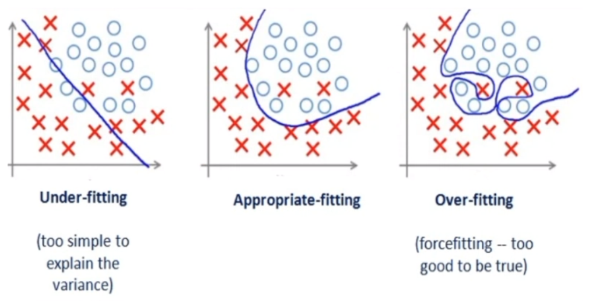

#### Erro de validação

- Para verificar $E_{out}$, utilizamos o conjunto de validação para computar o $E_{val}$
  - $E_{val}$ é um *proxy* do $E_{out}$
  - Examinando o $E_{val}$ é possível detectar overfitting

- **Underfitting:** tanto $E_{in}$ quanto $E_{val}$ são grandes 
- **Overfitting:** enquanto $E_{in}$ diminui, o $E_{val}$ continua grande

#### Como lidar com overfitting

- **Regularização** — adicionar um termo de penalidade na função de custo 
- **Validação** — erro do conjunto de validação ($E_{val}$) pode ser usado para escolher uma família de hipóteses $\mathcal{H}$ de complexidade adequada

$$
\underbrace{E_{out}(h)}_{\text{validação estima esta quantidade}} = E_{in}(h) + \underbrace{\text{overfit penalty}}_{\text{regularização estima esta quantidade}}
$$

## Redes neurais

- Para os mesmos problemas de regressão logística

**Estrutura:**

- Camada de **entrada**, camadas **ocultas** e camadas  de **saída**

- Cada nó da rede é um **neurônio** (uma máquina linear)

  $\varphi ( w_1\varphi(s_1) + w_2\varphi(s_2) + w_3\varphi(s_3) + w_4\varphi(s_4))$

- **Forward pass** 

  $\hat{y} = \sum l (y_j, \hat{y}_j)$

- **Backward pass**

**Nomenclatura:**

- *Multilayer perceptron networks* (MLP), ou
- *Feedforward multilayer neural networks*

### Perceptron 

- O perceptron como neurônio:

  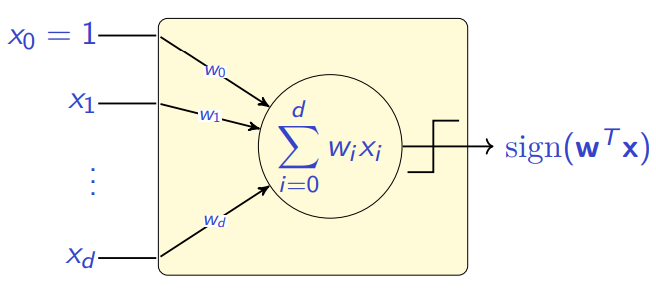

- O perceptron (camada única, como vimos) é uma máquina linear $g(x) +$ decisão $\phi$

  $\text{output}= \phi(g(x))=\phi(w^Tx)$

- **Função do sinal:**

  $\phi(x) = \cases{+1, \text{ se } z>0 \\ -1, \text{ se } z \leq 0 }$

- **Função de passo:**

  $\phi(x) = \cases{1, \text{ se } z>0 \\ 0, \text{ se } z \leq 0 }$

- Implementação da função $OR$ com o perceptron

- Implementação da função $AND$ com o perceptron

- **$XOR$ não é linearmente separável**

  - Basta usar duas funções lineares: 3 perceptrons ($g_1, g_2$ e $f$ que descreve o operador lógico $AND/OR$)

    $f = g_1\bar{g_2} + \bar{g_1}g_2$

  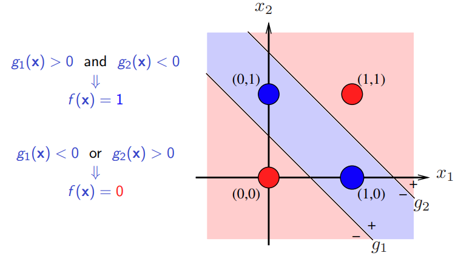

- A função $XOR$ permite criar uma **rede de duas camadas** de perceptron

**O perceptron multilayer**

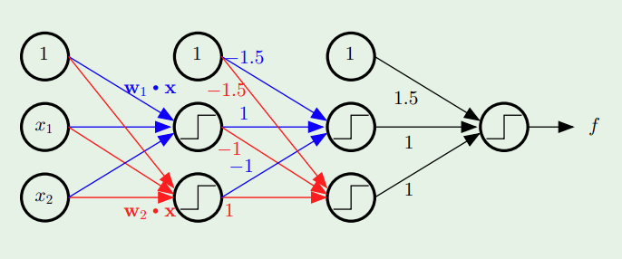

- 3 camadas "*feedforward*"

**Configurações mais complexas**

- Se quiser algo mais refinado, basta aumentar o número de retas (de perceptrons)

### Múltiplos hiperplanos

- Sejam $p$ funções lineares dadas por $g_i$. Cada função define um perceptron $\phi(g_i(x))$, e vamos considerá-los comos os nós da primeira camada oculta

- A saída da primeira camda é um elemento em $y \in \mathbb{R}^p$
  $$
  y = (\phi(g_1(x)), \phi(g_2(x)), \dots, \phi(g_p(x))) = (y_1, y_2, \dots, y_p)
  $$

- Já que $\phi (\cdot) \in \{0,1\}, (y_1, y_2, \dots, y_p)$ é um vértice do hipercubo unitário $H_p$ em $\mathbb{R}^p$
- Isso implica que todos os pontos de $X = \mathbb{R}^d$ em uma região particular (dentre aqueles definidos por $g_i()$) são mapeados para um mesmo vértice de $H_p$

- Podemos utilizar um **classificador linear** em $H_p$ — isso separaria alguns vértices como positivos e os outros como negativos
- O efeito disso é a classificação das regiões como $0$ ou $1$
- Mas as classes das regiões podem corresponder a uma configuração $XOR$ em $H_p$

#### Rede de 3 camadas de perceptron

- Em vez de utilizar apenas um classificador linear na segunda camada, podemos utilizar $k$ nós, um em cada vértice correspondendo a uma região da classe $1$ (isso pode ser facilmente implementado pela função $AND$)
- Então, adicionamos uma terceira camada que irá computar o $OR$ das saídas da camada anterior

- **Camadas:**
  - **PRIMEIRA CAMADA:** cada nó define um hiperplano em $\mathbb{R}^d$
    - O conjunto de hiperplanos define poliedros (regiões) 
    - A saída da primeira camadas é um vértice de um hipercubo em $\mathbb{R}^d$.
  - **SEGUNDA CAMADA:** cada nó seleciona um vértce no hipercubo, que corresponde à região (poliedro) em $\mathbb{R}^d$
    - Um nó para cada região de interesse
  - **TERCEIRA CAMADA:** os nós são unidos (via $OR$) às saídas da camada anterior
    - Se o input é uma das regiões selecionadas, então o output será positivo
- **Conclusão:** com 3 camadas de perceptron, é possível representar qualquer união de poliedros definidos em $\mathbb{R}^d$

**No entanto...**

- Um número imenso de perceptrons seria necessário para aproximar fronteiras com curvas suaves
- Números altos de nós na segunda camada também
- Não há algoritmo para desenvolver tal rede

#### Redes neurais multi-layer

- Em cada neurônio (perceptron) adicionamos uma função de ativação $\phi$ (função de passo ou sinal) com uma função contínual e diferenciável

- A rede neural:

  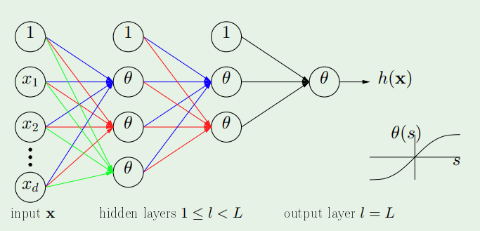

#### Teorema da aproximação universal 

- **Cybenko, G**: "Qualquer função contínua pode ser aproximada por uma sobreposição de funções sigmoides"
  $$
  F(x) = \sum^N_{i=1}v_i \varphi (w_i^Tx+b_i)
  $$

- Portanto, teoricamente, qualquer função contínua pode ser aproximada por uma rede neural com uma camada oculta

### Algoritmo de *backpropagation*

(*Multilayer feedforward network training*)

Queremos encontrar um $w$ que minimiza uma função de custo $J(w)$.

Vamos supor uma rede com $c$ saídas e a seguinte função de perda:
$$
J(w) = \frac{1}{2}\sum^c_{k=1} (t_k - z_k)^2
$$

- $t_k$: saída esperada (*target*)
- $z_k$: saída predita (resultado do *forward pass*)

**Notações:**

Vamos considerar um nó geral $j$ na rede:

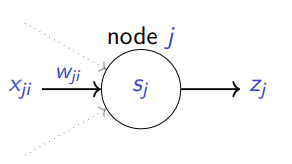

- $x_{ji}$ é a $i$-ésima entrada do nó $j$

- $w_{ji}$ é o peso relativo à $i$-ésima entrada do nó $j$
  $$
  \begin{matrix}
  s_j = \sum_i w_{ji} x_{ji} & z_j = \phi(s_j) & (x_{ji} = z_i)
  \end{matrix}
  $$

#### Computação do gradiente

**Gradiente de $J$ com respeito a $w_{ji}$:**

$w_{ji}$ influencia o resto da rede por meio de $s_j$:

$$
\frac{\partial J}{\partial w_{ji}} = \frac{\partial J}{\partial  s_j} \frac{\partial s_j}{\partial w_{ji}}
$$
Como $s_j = \sum_i w_{ji}x_{ji}$, então
$$
\frac{\partial J}{\partial w_{ji}}= \frac{\partial J}{\partial  s_j} x_{ji}
$$
Se $j$ é um nó na camada de saída, assim como $w_{ji}$ pode influenciar o resto da rede apenas por meio de $s_j$, $s_j$ pode influenciar o resto das redes apenas por meio de $z_j (z_j = \phi(s_j))$
$$
\frac{\partial J}{\partial  s_j} = \frac{\partial J}{\partial  z_j}  \frac{\partial z_j}{\partial s_j}
$$
Se o nó $j$ está em alguma das outras camadas anteriores, então $s_j$ afeta $J$ por meio de todos os nós $k$ na camada subsequente:
$$
\frac{\partial J}{\partial  s_j} = \sum_k \frac{\partial J}{\partial  s_k}  \frac{\partial s_k}{\partial s_j}
$$

#### Pesos relacionados aos nós da camada de saída

Suponha que $j$ é um nó na camada de saída

$s_j$ afeta $J$ por meio de $z_j$ 
$$
\frac{\partial z_j}{\partial  s_j} = \frac{\partial \phi(s_j)}{\partial  s_j} = \phi'(s_j)
$$

$$
\frac{\partial J}{\partial  z_j} = \frac{\partial}{\partial  z_j} [\frac{1}{2} \sum^c_{k=1}(t_k - z_k)^2] = \frac{1}{2} 2(t_j - z_j) \frac{\partial (t_j - z_j}{\partial z_j} = - (t_j - z_j)
$$

Portanto
$$
\frac{\partial J}{\partial w_{ji}}= \frac{\partial J}{\partial  s_j} x_{ji} = - \underbrace{(t_j - z_j) \phi'(s_j)}_{\delta_j} x_{ji}
$$

#### Pesos relacionados aos nós das camadas ocultas

Suponha que $j$ é um nó de uma camada oculta

Devemos considerar todas as maneiras na quais $s_j$ afeta $J$ (cada nó para onde sua saída é propagada)
$$
\begin{align}
\frac{\partial J}{\partial  s_j} & = \sum_k \frac{\partial J}{\partial  s_k}  \frac{\partial s_k}{\partial s_j} =  \sum_k  - \delta_k \frac{\partial s_k}{\partial s_j} =  \sum_k  - \delta_k \frac{\partial s_k}{\partial s_j} \frac{\partial z_j}{\partial s_j} \\
& =  \sum_k  - \delta_k w_{kj} \frac{\partial z_j}{\partial s_j} =  \sum_k  - \delta_k w_{kj} \phi'(s_j)
\end{align}
$$
Portanto
$$
\frac{\partial J}{\partial w_{ji}}= \frac{\partial J}{\partial  s_j} x_{ji} = - \underbrace{[\sum^c_{k=1} w_{jk} \delta_k]  \phi'(s_j)}_{\delta_j} x_{ji}
$$

#### Conclusão

$$
w(r+1) = w(r) + \Delta w(r) \\
\Delta w (r) = - \eta \nabla J(w)
$$

Se $k$ é um nó na camada de saída:
$$
\Delta w_{kj} = \eta \underbrace{(t_k - z_k) \phi' (s_k)}_{\delta_k} x_{kj}
$$
Se $j$ é um nó na última camada oculta:
$$
\Delta w_{ji} = \eta \underbrace{[\sum^c_{k=1} w_{jk} \delta_k] \phi' (s_j)}_{\delta_j} x_{ji}
$$
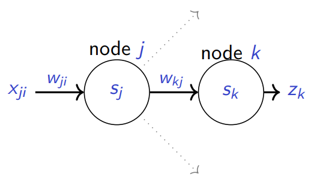

Se considerarmos a sigmoide como função de ativação $\phi$:
$$
\delta_k = z_k (1 - z_k)(t_k - z_k) \\
\delta_j = z_j(1 - z_j) \sum^c_{k=1} w_{kj} \delta_k
$$

### Comentários

- (Resultado teórico) Redes neurais com três camadas podem representar funções arbitrárias (uma camada oculta)
- O princípio de *backpropagation* é o mesmo para qualquer função de custo (nós consideramos a MSE)
  - Precisa ser diferenciável
- O gradiente descendente pode convergir para um mínimo local
- Camadas ocultas podem ser entendidas como representações transformadas implícitas dos dados de entrada
- Treinar redes neurais não é simples porque há muitos **hiper parâmetros** que precisam ser especificados antes do treinamento
  - arquitetura da rede
  - função de ativação
  - função de custo
  - normalização dos dados
  - regularização
  - treinamento em *batches* X estocástico
  - critério de parada
  - taxa de aprendizado, momento

### Bibliotecas

- TensorFlow – https://www.tensorflow.org

- Keras – https://keras.io

- PyTorch – https://pytorch.org

## Avaliação de performance

Uma vez que uma hipótese $g$ é selecionada, como estimamos sua performance?

- Para isso, precisamos de um *dataset* independente $D_{test}$ ($D_{test}$ é um conjunto com amostras que não estão em $D_{train}$)

- $E_{out}$ pode ser estimado como $E_{in}$, mas sobre o conjunto $D_{test}$

- $E_{in}$ e $E_{out}$ estão relacionados à função de perda
- Frequentemente, é conveniente avaliar outras métricas de performance

### Regressão

- Otimizamos a MSE durante o treinamento para obter $g$
- $g$ pode ser avaliada no $D_{test}$ em termos de
  - MSE
  - MAE
  - coeficiente de determinação (R quadrado)

### Classificação

- Otimizamos a perda *cross-entropy* durante o treinamento para obter $g$

- As saídas de $g$ são um score que pode ser interpretado como $P(y=1|x)$

- Uma decisão óbvia seria
  $$
  \hat{y} = \cases{1, \text{ se } g(x) > 0.5, \\ 0, \text{ se } g(x) \leq 0.5}
  $$

### Tipos de erro em problemas de classificação binária

- Classes: positiva e negativa

- **4 casos possíveis:**

  - Positivo Verdadeiro  ($TP$)

    $y = 1$ e $\hat{y} = 1$

  - Positivo Falso ($FP$)

    $y = 0$ e $\hat{y} = 1$

  - Negativo Falso ($FN$)

    $y = 1$ e $\hat{y} = 0$

  - Negativo Verdadeiro ($TN$)

    $y = 0$ e $\hat{y} = $0

- Métricas derivadas desses casos:
  - **Matriz de confusão**
  - **Precisão** = $TP/(TP + FP)$
  - **Recall** = $TP/(TP + FN)$
  - **False positive rate (FPR)** = $FP/(FP + TN)$
  - **Acurácia** = $(TP + TN)/(TP + FP + TN + FN)$
  - **F1-score** = $2 * (\text{Precisão} * \text{Recall})/(\text{Precisão} + \text{Recall})$

#### E em problemas de classificação multiclasse?

Seja $TP_j, FP_j, TN_j, FN_j$, para cada $j$ (classe $j$ contra o resto)

- ***Micro-averaging***
  - Compute $TP = \sum TP_j$, $FP = \sum FP_j$, $TN = \sum TN_j$, $FN = \sum FN_j$
  - Compute a métrica performance de cada $TP, FP, TN, FN$
  - Atribui a mesma importância para cada exemplo — classes maiores dominam
- ***Macro-averaging***
  - Compute a métrica de performance para cada classe, de $TP_j,  FP_j, TN_j, FN_j$
  - Compute a média de cada métrica
  - Atribui mesma importância a todas as classes

#### Aceitar falsos negativos ou falsos positivos?

-  $TP, FP, TN, FN$ depende do limite $T$
  $$
  \hat{y} = \cases{1, \text{ se } g(x) > 0.5, \\ 0, \text{ se } g(x) \leq 0.5}
  $$

  - No caso do exemplo acima, $T = 0.5$
  - Podemos escolher outros valores diferentes de $0.5$ para o limite $T$

- Se for melhor aceitar $FP$ do que $FN$, então $T$ deve ser baixo

- Se for melhor aceitar $FN$ do que $FP$, então $T$ deve ser alto

- Frequentemente queremos maximizar os $TP$

  - *recall* alto

- Ao mesmo tempo, queremos minimizar $FP$

  - pequeno FPR (alta precisão)

- **Curva ROC** e **curva PR** são frequentemente utilizadas como ferramentas para atender *recall* e precisão simultaneamente

#### Curva ROC *(Receiver operating characteristic)*

- $T = 1.0 \implies$ todos os dados são classificados como negativos ($TP=0\%$ e $FP=0\%$)
- $T = 0.0 \implies$ todos os dados são classificados como positivos ($TP=100\%$ e $FP=100\%$)

Enquanto variamos $T$ entre $1.0$ e $0.0$:

- **Classes perfeitamente separadas**: $TP$ chega a $100\%$ enquanto $FP$ fica em $0\%$, e apenas depois disso $FP$ começa a aumentar
- **Caso geral**: $TP$ começa a aumentar, mas a $FP$ também

**AUC ROC** (Área sob curva ROC)

- É frequentemente utilizada como métrica de performance
- **AUC** varia de $0.5$ a $1.0$
- Quanto mais perto de $1.0$, melhor o classificador
- Mas a **AUC** pode ser *misleading* quando o *dataset* está desbalanceado

#### Curva PR (*precision-recall*)

- Não depende do desbalanceamento entre as classes

### Na prática, como escolher uma hipótese?

- Qual espaço de hipóteses usamos?
- Qual algoritmo devemos usar?
- Como os hiper parâmetros devem ser ajustados?

Podemos usar 3 tipos de *datasets* para estimar o erro de hipótese:

- Treinamento ($E_{in}$)
- Validação ($E_{val}$)
- Teste ($E_{test}$)

Eles são computados em momentos diferentes:

- Durante o treinamento computamos $E_{in}$
- Para a seleção de hipóteses, computamos $E_{val}$
- Para estimar $E_{out}$ a partir do modelo selecionado computamos $E_{test}$

Ambos $E_{val}$ e $E_{test}$ são estimações de $E_{out}$

- $E_{val}$ é otimista (enviesado)
- $E_{test}$ não é viesado

#### Estimando $E_{out}$

- Particione o *dataset* existente em dois subconjuntos:
  $$
  D = D_{train} \cup D_{test}
  $$
  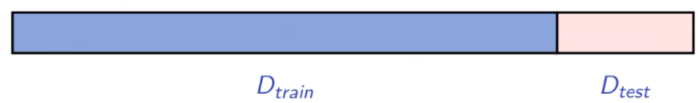

- $D_{train}$ é usado para treinamento e para computar $E_{in}$
- $D_{test}$ é usado para computar $E_{test}$, uma estimativa não viesada de $E_{out}$

#### Potenciais problemas de $E_{test}$ como estimador de $E_{out}$

​	Seja o tamanho dos conjuntos: $|D_{train}|$, $|D_{test}|$ e $|D| = |D_{train}| + |D_{test}|$

- $|D_{test}|$ grande $\implies |D_{train}|$ pequeno ( a hipótese não é boa)
- $|D_{test}|$ pequeno $\implies E_{test}$ dificilmente será uma boa estimativa de $E_{out}$
- quando $D_{train}$ e/ou $D_{test}$ tem algum viés

**Problemas quando usamos $E_{test}$ para selecionar uma hipótese final**

- $E_{test}$ da hipótese escolhida passa a ser um estimador otimistamente enviesado de $E_{out}$

### Nas próximas aulas...

- Conjuntos de validação são comumente usados para escolher uma hipótese final do conjunto de hipóteses pré-selecionadas, baseadas em $E_{val}$ 
- Métodos de ***cross-validation*** para reduzir a variância do $E_{val}$
- Conjunto de teste pode ser usado para fazer uma estimativa não viesada do $E_{out}$ (se $D$ estiver disponível...)

## Validação

$$
E_{out} = E_{in} + \text{erro de generalização}
$$

- Overfitting

### O impacto do nível de ruído e a complexidade da target function

$$
y = f(x) + \underbrace{\epsilon(x)}_{\sigma^2} = \underbrace{\sum^{Q_f}_{q=0} \alpha_q x^q}_{\text{normalizado}} + \epsilon(x)
$$

- Nível de ruído: $\sigma^2$
- Complexidade da *target*: $Q_f$
- Tamanho do *dataset*: $N$

### A medida de overfitting:

- Nós fittamos o dataset usando nossos 2 models:
  - $\mathcal{H}_2$: polinômios de grau 2
  - $\mathcal{H}_{10}$: polinômios de grau 10
- Compare os erros fora da amostra de $g_2 \in \mathcal{H}_2$ e $g_{10} \in \mathcal{H}_{10}$
- A medida: $E_{out}(g_{10}) - E_{out}(g_2)$

### Ruídos

- **Ruído estocástico**: muito esforço em tentar reduzir $E_{in}$ leva a fittar o ruído nos dados
- **Ruído determinístico:** há "uma certa complexidade $\mathcal{H}$" para cada target e quantia $N$ dos dados de treinamento

### Validação VS regularização

Em outra forma:
$$
E_{out}(h) = E_{in}(h) + \text{penalidade de overfit}
$$

- A regularização tenta estimar a $\text{penalidade de overfit}$
- A validação tenta estimar o $E_{out}(h)$
  - Como computar uma estimativa melhor do $E_{out}$?

### Erro de validação

- Particione o *dataset* existente em dois subconjuntos: $D = D_{train} \cup D_{test}$

- $E_{val}$ é uma estimativa não viesada de $E_{out}$
  $$
  E[E_{val}(g)] = E_{out}(g)
  $$

- Seja $K = |D_{val}|$. Então
  $$
  E_{val}(g) = E_{out}(g) \pm O(\frac{1}{\sqrt{K}})
  $$
  
- $K$ grande gera uma boa estimativa de $E_{out}$ (variância grande)
- O conjunto $D$ é finito: há um trade-off
  - $|D_{val}|$ grande $\implies |D_{train}|$ pequeno (pequena quantia de dados de treinamento) $\implies E_{out}$ grande e $E_{val} \approx E_{out}$
  - $|D_{val}|$ pequeno $\implies |D_{train}|$ grande $\implies$ é possível que $E_{out}$ seja pequeno, mas $E_{val}$ tem grande variância
- Nós podemos treinar uma hipótese $g$ em $D$ e reportar $E_{val}$ da hipótese $g^-$ trainada em $D_{train}$ (mas $E_{val}(g^-)$ não é uma estimativa de $E_{out}(g)$)
- Na prática, $K = N/5$ é uma boa escolha

### O dilema sobre $K$

A seguinte cadeia de de raciocínio:
$$
E_{out}(g) \approx E_{out}(g^-) \approx E_{val}(g^-) \\
(K \text{ pequeno})\ \ \ \ (K \text{ grande})
$$
destaca o dilema em selecionar $K$: podemos ter $K$ grande e pequeno ao mesmo tempo?

### Deixe um de fora

$N-1$ pontos para o treinamento, e $1$ ponto (neste caso, $(x_n, y_n)$) para validação:
$$
D_n = (x_1, y_1), \dots, (x_{n-1}, y_{n-1}), (x_{n+1}, y_{n+1}), \dots, (x_N, y_N)
$$
Hipótese final aprendida por $D_n$ é $g_n^-$
$$
e_n = E_{val}(g_n^-) = e(g_n^- (x_n), y_n)
$$
Erro de *cross-validation*:
$$
E_{CV} = \frac{1}{N} \sum^N_{n=1} e_n
$$
Treinamento é repetido $N= |D|$ vezes

Na rodada de treinamento $i$, $D^{(i)}_{train} = D \setminus \{x^{(i)} \} $ e $D^{(i)}_{val} = D  \{x^{(i)} \}$$

Erro de *cross-validation*: 
$$
E_{CV} = \frac{1}{N} \sum^N_{n=1} E_{val}^{(i)}
$$
$g_i^-$: hipótese treinada em $N-1$ exemplos

Podemos mostrar que $E_{CV}$ é um estimador não enviesado de $E[E_{out}(g^-)]$

### k-fold cross validation

- Dividir $D$ em $k$ partes $D_1, D_2, \dots, D_k$ de tamanhos aproximadamente iguais
- Repita o treinamento $k$ vezes

$$
E_{CV} = \frac{1}{k} \sum^k_{n=1} E_{val}^{(i)}
$$

- É caro

### $E_{cv}$ é um bom estimador de $E_{out}$?

- $k$ modelos $\implies k$ valores para $E_{out} \implies$ média $\bar{E}_{out}$
- A variância de $E_{CV}$ não pode ser facilmente computada
- Empiricamente, $E_{CV}$ é um bom estimador de $\bar{E}_{out}$
- Ainda há muita discussão sobre o tema

### Na prática...

- Para o *holdout method* ($D = D_{train} \cup D_{val}$), uma proporção comum é de 70%-80% para treinamento e 20%-30%​ para validação
- Para $k$-*fold cross-validation*, geralmente $k$ é 5 ou 10

### Seleção de modelo

- Hipótese $g \in \mathcal{H}$
- Treinando dois modelos $g_1, g_2$, podemos comparar $E_{val}(g_1)$ e $E_{val}(g_2)$
- Costuma-se escolher aquele que tiver menor erro de validação
- Testes estatísticos podem ser aplicados para verificar se os erros são iguais
  - Holdout error: teste de hipótese
  - Cross validation: teste

### Uma discussão interessante

- Se usarmos $E_{val}$ para a seleção de modelo, $E_{val}$ não é mais uma estimativa não enviesada de $E_{out}$
- Podemos fazer a mesma análise com $E_{val}$ e $E_{out}$, para $M$ hipóteses, usando a desigualdade de Hoeffding
- Quanto maior o $K$, menor é o bound

### *Early stopping*

- Podemos pensar que temos um grande número de escolhas

- É por isso que validation funciona

### O processo da seleção de modelo e avaliação de performance

1. Divide o dataset
2. Isola do conjunto de teste
3. Usa o conjunto de treino e validação para treino e escolha de modelo
4. O modelo escolhido pode ser re-treinado usando o conjunto inteiro de treino com validação
5. Tendo o modelo final, computar $E_{test}$ sobre o conjunto de teste
   - $E_{test}$ seria um estimador menos enviesado de $E_{out}$ do que $E_{val}$ e $E_{CV}$

### Comentários finais

- Muitas vezes só queremos escolher o melhor modelo, não estimar $E_{out}$
- É comum não considerar o conjunto de teste
- Obviamente, o erro de validação do modelo escolhido é enviesado
- A mesma observação se mantém com respeito a qualquer uma das métricas computadas no conjunto de validação, após um modelo ser escolhido baseado no valor de $E_{val}$

## Regularização

Duas abordagens para regularização:

- **Matemática**: problemas mal-representados em aproximações de função
  - É útil para obter uma intuição dos problemas
- **Heurística**:  criar obstáculos para a minimização de $E_{in}$

Em um exemplo com retas no plano 2D, a regularização pode **restringir** as retas em termos do *offset* e da inclinação que elas podem ter — assim, **sacrificamos o "*fit* perfeito"** no conjunto de treinamento (o que, na verdade, pode ser bom!)

- Numa análise *bias-variance*, regularização pode trazer um ***bias* ligeiramente maior (**o *fit* não é perfeito), mas uma **variância bem menor**

### O modelo polinomial

- $\mathcal{H}_Q$: polinômios de ordem $Q$
- regressão linear no espaço $Z$

$$
z = \begin{bmatrix} 1 \\ P_1(x) \\ \vdots \\ P_Q(x) \end{bmatrix},
\ \ \ \ \ \ \
\mathcal{H}_Q = \{ \sum^Q_{q=0} w_q P_q(x)  \}
$$

- Polinômios de Legendre:

### Solução sem restrições

Dados $(x_1, y_1), \dots, (x_N, y_N) \rightarrow (z_1, y_1), \dots, (z_N, y_N)$

Minimize $E_{in}(w) = \frac{1}{N} \sum^N_{n=1}(w^Tz_n-y_n)^2$

No formato de vetores: $\frac{1}{N} (Zw - y)^T(Zw - y)$

Então: $w_{lin} = (Z^TZ)^{-1}Z^Ty$

### Restringindo os pesos

- **Restrição forte:** $\mathcal{H}_2$ é uma versão restringida de $\mathcal{H}_{10}$, com $w_q = 0$ para $q>2$
  - (Já estávamos fazendo isso)

- **Versão mais fraca:** $\sum^Q_{q=0} w^2_q \leq C$ — restrição de "**ordem fraca**"
  - (Um pouco melhor)

Minimize $\frac{1}{N} (Zw - y)^T(Zw - y)$

​					sujeito à $w^Tw \leq C$

Solução: $w_{reg}$em vez de $w_{lin}$

#### Resolvendo para $w_{reg}$

Minimize $\frac{1}{N} (Zw - y)^T(Zw - y)$

​					sujeito à $w^Tw \leq C$

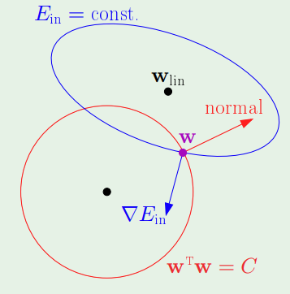

- Escolhendo um $w$ dentro da área que respeita a restrição, podemos calcular o gradiente da perda (minimizá-la) e descobrir a direção para onde $w$ deveria ir
  - $\nabla E_{in}$ deve ser ortogonal à elipse azul
  - $w$ é ortogonal à circunferência vermelha

- Pelo desenho notamos que conforme movemos $w$ pela borda da circunferência, o valor de $E_{in}$ muda
  - Mais do que isso: se movermos no sentido anti-horário, $E_{in}$ diminui!
  - Então este $w$ atual não é mínimo: queremos que a normal e $\nabla E_{in}$ apontem para sentidos opostos

$$
\begin{align}
	\nabla E_{in}(w_{reg}) & \propto - w_{reg} \\
	& =  - 2 \frac{\lambda}{N} w_{reg} \\
	\nabla E_{in}(w_{reg}) & + 2 \frac{\lambda}{N} w_{reg} = \vec{0}
\end{align}
$$

- Minimize $E_{in}(w) + \frac{\lambda}{N}w^Tw$
  - Agora temos que minimizar uma equação sem condições: bem mais simples :-)
  - ***Augmented error:*** $E_{aug}(w) = E_{in}(w) + \frac{\lambda}{N}w^Tw$

- Verificando a relação ente $C$ e $\lambda$: $C \uparrow \iff \lambda \downarrow$

#### A solução:

Minimize 
$$
\begin{align}
E_{aug}(w) & = E_{in}(w) + \frac{\lambda}{N}w^Tw\\ 
&= \frac{1}{N} ( (Zw - y)^T (Zw-y) + \lambda w^Tw)
\end{align}
\\
\nabla E_{aug}(w) = 0 \implies Z^T(Zw-y) + \lambda w = 0
$$
Portanto $w_{reg} = (Z^TZ + \lambda I)^{-1} Z^Ty$ (com regularização)

em oposição a $w_{lin} = (Z^TZ)^{-1}Z^Ty$ (sem regularização)

#### O resultado 

Minimizando $E_{in}(w) + \frac{\lambda}{N} w^Tw$ para diferentes $\lambda$'s:

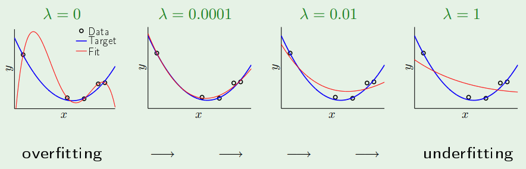

### *Weight 'decay'*

Minimizar  $E_{in}(w) + \frac{\lambda}{N} w^Tw$ é chamado *weight decay*

**Decay?**

- Gradiente descendente:

$$
\begin{align}
w(t+1) & = w(t) - \eta \nabla E_{in} (w(t)) - 2 \eta \frac{\lambda}{N}w(t) \\ 
&= w(t) (1 - 2 \eta \frac{\lambda}{N}) - \eta \nabla E_{in} (w(t))
\end{align}
$$

- Aplicado à redes neurais:
  $$
  w^Tw = \sum^L_{l=1} \sum^{d^{(l-1)}}_{i=0} \sum^{d^{(l)}}_{j=1} (w_{ij}^{(l)})^2
  $$

  - *backpropagation*: de uma camada pra outra, vai decaindo

#### Variações do *weight decay*

Ênfase em certos pesos: $\sum^Q_{q=0} \gamma_q w^2_q$

Exemplos:

- $\gamma_q = 2^q \implies$ *fit* de baixa ordem
- $\gamma_q = 2^{-q} \implies$ *fit* de alta ordem

Redes neurais: diferentes camadas tem diferentes $\gamma$'s

**Regularizador de Tikhonov:** $w^T T^T T w$

#### *Weight growth*?

- Restringimos os pesos para serem grandes: **ruim**!
- Regra prática:
  - **ruído estocástico** é de "alta frequência"
  - **ruído determinístico** não é suave também
- $\implies$ restrinja o aprendizado de modo que ele escolha hipóteses suaves
  - Em geral, pesos menores correspondem à hipóteses mais suaves

#### Forma geral do *augmented error*

Seja o regularizador $\Omega = \Omega(h)$, minimizamos $E_{aug}(h) = E_{in}(h) + \frac{\lambda}{N}\Omega(h)$

- Esta forma nos lembra bastante $E_{out}(h) \leq E_{in}(h) + \Omega(\mathcal{H})$
  - $E_{aug}$ é um melhor representante de $E_{out}$ do que $E_{in}$

### Escolhendo um regularizador

- O regularizador perfeito $\Omega$: é um que restringe a "direção" da *target function*
  - Mas não sabemos a *target function*!
  - Princípio guia: mova-se na direção **mais suave** ou mais simples (ruído não é suave!)
  - Escolheu um $\Omega$ ruim? Ainda temos $\lambda$!

#### Regularizadores para redes neurais

- ***Weight decay***: de linear para lógico

- ***Weight elimination:***

  - Quanto menos pesos, menor é a dimensão VC

  - *Soft weight elimination*:
    $$
    \Omega(w) = \sum_{i,j,l} \frac{(w_{ij}^{(l)})^2}{\beta ^2 + (w_{ij}^{(l)})^2}
    $$

    - Para pesos muito pequenos, você está fazendo *weight decay*
    - Para pesos muito grandes os $w$'s dominam (perto de 1)

#### *Early stopping* como um regularizador

- Regularização por meio do otimizador
- Quando parar? **validação**
- Cuidado: separe os conceitos de regularizar e otimizar!

#### O $\lambda$ ótimo

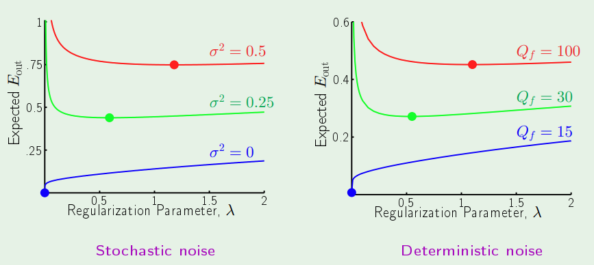

- **Para ruído estocástico**:
  - Quando não há ruído, regularização não é indicada (não há *overfitting* para lidar)
  - Quanto maior o nível de ruído ($\sigma^2$), mais regularização é necessária
- **Para ruído determinístico**:
  - Quanto maior a complexidade da *target function* ($Q_f$), maior o ruído determinístico
  - O comportamento é o mesmo do ruído estocástico

## Support Vector Machines (SVM)

- A ideia de maximizar a margem

### O problema de classificação binária no caso linearmente separável

- Para tornar a solução mais robusta, é uma boa ideia ter uma reta com a maior margem possível
- Como encontrar um **hiperplano separador que maximiza a margem**?
- No SVM, formulamos o problema como um problema de otimização de **programação quadrática (QP)**
  - Funções quadráticas, restrições lineares

$$
h(x) = sign(w^Tx + b)
$$

- Relacionar $w$ e $b$ à margem (distância entre $H$ e o ponto mais próximo dentre todos os $D$)

### Calculando o melhor hiperplano

Seja $D$ um conjunto de pontos linearmente separáveis, $x_n \in D$, e um hiperplano separador $H$ caracterizado por $w,b$

Então:
$$
dist(x_n, H) = \frac{1}{\|w\|} y_n (w^T x_n + b)
$$
Podemos sempre escolher $(w,b)$ tais que o ponto $x_n$ mais próximo de $H$ que satisfaz:
$$
y_n (w^T x_n + b) = 1
$$
Neste caso:
$$
dist(x_n, H) = \frac{1}{\|w\|}
$$

### O problema que queremos resolver

$$
\begin{align}
\text{maximize}_{w,b} & \frac{1}{\|w\|} \\
\text{sujeito à } & \min_{n=1, \dots, N} y_n(w^Tx_n + b) = 1
\end{align}
$$

- A restrição $\min_{n=1, \dots, N} y_n(w^Tx_n + b) = 1$ implica que $y_n(w^Tx_n + b) \geq 1$, o que não tem efeito de forçar todos os exemplo a serem classificados corretamente
- A igualdade $\min_{n=1, \dots, N} y_n(w^Tx_n + b) = 1$ implica que a distância do ponto mais próximo ao hiperplano é $\frac{1}{\|w\|}$ (uma boa função objetiva!)

**Fórmula dual equivalente:**
$$
\begin{align}
\text{minimize}_{w,b} & \frac{1}{2}w^Tw \\
\text{sujeito à } & \min_{n=1, \dots, N} y_n(w^Tx_n + b) = 1
\end{align}
$$
**Fórmula relaxada equivalente:**
$$
\begin{align}
\text{minimize}_{w,b} & \frac{1}{2}w^Tw & \\
\text{sujeito à } & y_n(w^Tx_n + b) \geq 1, & n = 1 \dots, N
\end{align}
$$

- O problema linearmente separável é  **hard margin** (nenhum ponto viola a margem)

### O problema não linearmente separável

- **Soft margin**: $y_n(w^Tx_n + b) \geq 1 - \xi$

A fórmula:
$$
\begin{align}
\text{minimize}_{w, b, \xi} & \frac{1}{2}w^Tw + C \sum^N_{n=1} \xi_n & \\
\text{sujeito à }     & y_n(w^Tx_n + b) \geq 1 - \xi_n, 			   & \text{para } n = 1, \dots, N; \\
					  & 									   & \xi_n \geq 0 \text{ para } n = 1, \dots, N.
\end{align}
$$
$C \geq 0$ é um parâmetro especificado pelo usuário: quanto maior o $C$, menor é a violação da margem permitida

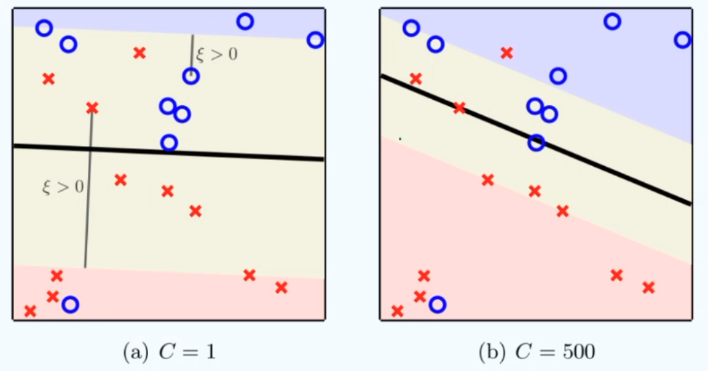

### Como resolver problemas de otimização QP?

Primal: otimização QP padrão

Dual: baseado na formulação de Lagrange

### Forma padrão de problemas QP

$M$ restrições desigualdades e $Q$ positiva semidefinida
$$
\begin{align}
\text{minimize}_{u} & \frac{1}{2}u^TQu + p^T u \\
\text{sujeito à }     & a^T_mu \geq c_m, 			   & (m = 1, \dots, M)
\end{align}
$$
Na forma de matriz:
$$
\begin{align}
\text{minimize}_{u} & \frac{1}{2}u^TQu + p^T u \\
\text{sujeito à }     & Au \ge c
\end{align}
$$
QP solvers podem ser usados para computar a solução ótima $u^*$:
$$
u^* \rightarrow QP(Q, p, A, c)
$$
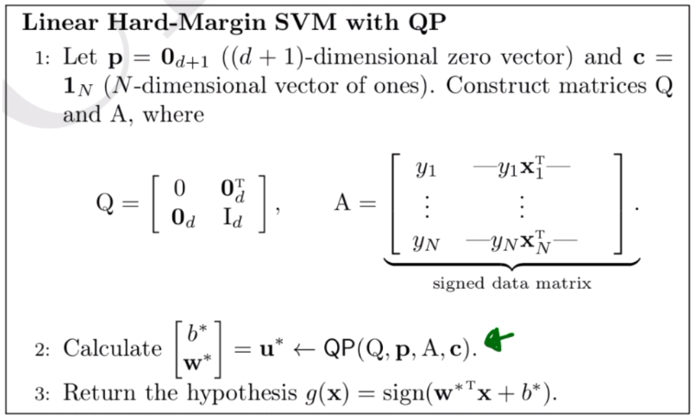

### Formulação dual

Para um problema QP convexo e factível, na forma primal:
$$
\begin{align}
\text{minimize}_{u} & \frac{1}{2}u^TQu + p^T u \\
\text{sujeito à }     & a^T_mu \ge c_m, & (m=1,\dots,M)
\end{align}
$$
defina a função Lagrangiana:
$$
\mathcal{L}(u, \alpha) = \frac{1}{2}u^TQu + p^T u + \sum^M_{m=1} \alpha _m (c_m - a^T_m u)
$$
A solução $u^*$ é ótima para o primal se e somente se $(u^*, \alpha^*)$ é uma solução para o problema de otimização dual
$$
\max_{\alpha \geq 0} \min_u \mathcal{L}(u, \alpha)
$$
